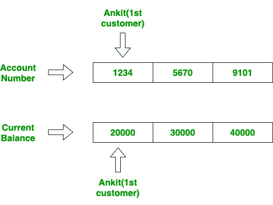

# 使用 Scala 的银行系统

> 原文:[https://www.geeksforgeeks.org/banking-system-using-scala/](https://www.geeksforgeeks.org/banking-system-using-scala/)

在这个项目中，我们将使用 Scala 构建一个简单的银行管理系统，该系统将执行以下任务:

1)显示所有客户或特定客户的现有详细信息。

2)添加或删除帐户

3)存款或取款

4)检查透支额度

5)显示利息和股息金额

**进场:**

这个程序使用了 Scala 中**继承、Scala 中的方法、If-else、方法覆盖、类和对象以及列表缓冲区的概念。**

有关上述概念的更多信息，请参考以下链接。

**a)斯卡拉的传承:**T2】https://www.geeksforgeeks.org/inheritance-in-scala/

**b)Scala 中的方法:**[https://www.geeksforgeeks.org/scala-functions-basics/](https://www.geeksforgeeks.org/scala-functions-basics/)

**c)方法覆盖:**[**https://www.geeksforgeeks.org/method-overriding-in-scala/**](https://www.geeksforgeeks.org/method-overriding-in-scala/)

****d)列表缓冲区:**[https://www . geeksforgeeks . org/scale-list buffer/](https://www.geeksforgeeks.org/scala-listbuffer/)**

**这个程序有 5 个类，分别是账户、储蓄账户、货币账户、银行和主类银行系统。**

****1)账户:**是父类，里面包含三种方式，分别是**借方()、贷方()**、**和明细()**。该类包含 4 个**列表缓冲区**，用于存储银行活期账户持有人的详细信息，按顺序存储，使得一个客户的银行账号及其对应的电话号码的索引将存储在不同列表缓冲区的相同索引值中。**

****

**如图所示，第一个客户的详细信息将存储在所有列表缓冲区的第一个索引中，第二个客户也是如此。稍后将使用 Credit()和 details()方法作为覆盖方法来显示任何客户的借方金额和详细信息。**

**下面的例子解释了它是如何工作的。**

## **斯卡拉**

```
class Account{

  // Creating four ListBuffer which stores
  // the initial details of customer
  var name = new ListBuffer[String]()
  name += ( "Ankit", "Rohit", "Rahul" )
  var balance_current = new ListBuffer[Int]()
  balance_current += ( 20000, 30000, 40000 )
  var account_number = new ListBuffer[Int]()
  account_number += ( 1234, 5678, 9101 )
  var phone_number = new ListBuffer[Long]()
  phone_number += ( 9998273493L, 5569392838L, 6651299039L )

  // details() method is used to show
  // the details of all customer
  def details(): Unit ={
    println("Details of customer is\nNames of customer: " + name +
            "\nBalance list" + "is respectively: " + balance_current +
            "\nAccount number is respectively: " + account_number +
            "\nPhone number" + "is respectively: " + phone_number)
  }

  // Used to add money to a particular account
  def credit(): Unit = {
    var credit_amount: Int = 0
    println("Enter the account number you want to credit in: ")

    // readInt is used to take integer
    // value as input from user
    val acc_num1 = readInt()

    // indexOf() method returns the index
    // of particular element
    val index1 = account_number.indexOf(acc_num1)
    println("Enter the amount you want to credit: ")
    credit_amount = readInt()
    balance_current(index1) += credit_amount
    println("Amount added successfully\nNew Balance is: " +
             balance_current(index1))
  }

  // Used to withdraw money from an account
  def debit(): Unit ={
    var debit_amount : Int = 0
    println("Enter the account number " +
            "you want to withdraw from: ")
    val acc_num2 = readInt()
    val index2 = account_number.indexOf(acc_num2)
    println("Enter the amount you want to withdraw: ")

    debit_amount = readInt()
    balance_current(index2) -= debit_amount
    println("Money withdrawn successfully\n" +
            "Remaining balance is: " +
            balance_current(index2))
  }
}
```

****说明:****

> ****列表缓冲区:**
> 列表缓冲区数据类型用于存储值**
> 
> ****借方():****
> 
> **amount _ initially = 20000
> 输入:200**
> 
>  **产量:19800
> //初始金额为 20000。它要求从中扣除 200 英镑
> 
> //因此最终金额变为
> 最终= 20000–200 =>19800
> 
> **信用():**
> 
> amount _ initially = 15000
> 
> 投入:2000 年
> 
> 产量:17000
> 
> //初始金额为 15000。它要求在里面存入 2000 英镑
> 
> //最终金额变为
> 最终= 15000 + 2000 = > 17000
> 
> **详细信息():**
> 输出:所有客户的详细信息
> 
> 输入:显示所有账户的详细信息。
> 
> 输出:
> 客户详情为
> 
> 客户名称:listburf(Ankit、Rohit、Rahul)
> 
> 余额列表分别为:列表缓冲区(20000，30000，40000)
> 
> 账号分别为:列表缓冲区(1234，5678，9101)
> 
> 电话号码分别为:listbarf(9998273493、5569392838、6651299039)**

****2)<u>SavingAccount</u>**T4:是 Account 类的子类，包含一个名为 **interest()** 的方法和一个名为 **details()的覆盖方法。利息()**方法用于显示任何特定账户的利息金额。它要求用户输入账号，然后使用下面显示的公式显示特定账户将获得的利息金额。**

**amount _ initial ly+(amount _ initial *利息)/ 100**

****Details()** 方法是 Account 类的一个覆盖方法，在这里用来显示任何特定客户的详细信息。早些时候，它显示了所有客户的详细信息。**

## **斯卡拉**

```
class SavingsAccount extends Account
{
  var interest : Double = 2

  // Method used to calculate interest
  def interest_amount(): Unit = {
    println("Enter the account number " +
            "to see the interest amount: ")

    val acc_num3 = readInt()
    val index3 = account_number.indexOf(acc_num3)
    interest =  (balance_current(index3) * 2) / 100
    println("The interest amount is: "+interest)
  }

  // Method used to view the details of
  // any particular account
  // using method overriding
  override def details(): Unit ={
    println("Enter the account_number to see its details: ")
    val acc_num4 = readInt()
    val index4 = account_number.indexOf(acc_num4)

    println("Details of this account is\n" +
            "Name of customer is: " + name(index4) +
            "\nAccount number is: " + account_number(index4) +
            "\nPhone number is: " + phone_number(index4)  +
            "\nAccount balance is: " + balance_current(index4))
  }
}
```

****说明:****

> ****利息():****
> 
> **输入:要查看当月利息金额的账号。
> 1234
> 输出:400.0**
> 
> **//利率最初固定为**
> 
> **//银行。400 是利息金额。**
> 
> ****详情():****
> 
> **输入:输入账号查看详情:
> 1234**
> 
> **输出:该帐户的详细信息为**
> 
> **客户名称为:安基特**
> 
> **账号为:1234**
> 
> **电话号码为:9998273493
> 账户余额为:20000**
> 
> **//显示详细信息(姓名、账号、**
> 
> **//电话号码和当前余额)**
> 
> **//用户询问的账户
> 。**

****3)<u>CurrentAccount:</u>**它也是 Account 类的子类，包含一个名为 **debit()** 的覆盖方法。这种方法用于用户想要取款的情况。它检查透支限额，这只是银行设定的最低限额，要求每个账户的余额都高于透支限额，以避免现金扣款。它使用以下公式:**

**余额 _ 当前–提取 _ 金额**

**如果这个公式失败，那么银行将拒绝提款请求。**

## **斯卡拉**

```
class CurrentAccount extends Account
{
  var overdraft_limit: Int = 2000

  // Using method overriding
  // method used to withdraw money
  override def debit(): Unit ={
    println("Enter the account number " +
            "you want to withdraw from: ")

    val acc_num5 = readInt()
    val index5 = account_number.indexOf(acc_num5)
    println("Enter the amount you want to withdraw: ")
    var debit_amount = readInt()

    if (balance_current(index5) - debit_amount < 2000)
    {
      println("Overdraft limit exceeded " +
              "transaction declined")
    }
    else
    {
      balance_current(index5) -= debit_amount
      println("Transaction successful\n" + "" +
              "Remaining balance is: " +
               balance_current(index5))
    }
  }
}
```

****说明:****

> ****覆盖借方():**** 
> 
> **//以账号为输入，检查透支额度。**
> 
>  **if(balance _ current(index 2)–借方 _ 金额
> 
> {
> 
> 超过透支限额
> 
> }
> 
> 其他
> 
> {
> 
> balance _ current(index 2)-= debit _ amount
> 
> println("剩余余额为:"+balance_current(index2))
> 
> }
> 
> //例如，如果当前余额为 30000，并且
> 
> //透支限额为 5000，则不能
> 
> //提取任何大于 25000 的金额。**

****4) <u>银行</u> :** 这个类也是对 Account 类的扩展，里面有 3 种方式，分别是**开户()、销户()**。此类用于期初、期末和查找股息金额。**

****开户()**方法用于在银行开立任何新账户。它会询问用户的姓名、密码和账号，并询问用户初始余额。然后，它使用列表缓冲区添加功能将所有这些分别添加到不同的列表缓冲区中。**

**List_Buffer +=元素**

****Closing()** 方法用于关闭 ListBuffer 中的任何现有账户和所有相关详细信息。它要求用户输入账号，然后使用列表缓冲区的 index of()方法检查该特定账号的索引，然后分别从所有列表缓冲区中删除该特定索引。**

**List_Buffer -=元素**

## **斯卡拉**

```
class Bank extends Account
{

  // Method to open an account
  def opening(): Unit ={

    // readLine() method is used to
    // take a string as input from user
    var new_name = readLine("Enter the name: ")
    name += new_name
    println("Enter the opening balance: ")
    var opening_balance = readInt()
    balance_current += opening_balance
    account_number += 1908
    println("Account added successfully")
  }

  // Method used to close an existing account
  def closing(): Unit ={
    println("Enter the account number: ")
    val acc_num6 = readInt()
    val index6 = account_number.indexOf(acc_num6)
    name -= name(index6)
    balance_current -= balance_current(index6)
    account_number -= account_number(index6)
    println("Account removed successfully")
  }
}
```

****说明:****

> ****开口():****
> 
>  **输入:输入您要存入的姓名、账号和初始余额
> 
> 输出:帐户添加成功
> 
> //要求用户输入账号和
> 
> //然后检查该特定帐户的索引
> 
> //使用 ListBuffer 的 indexOf()方法的数字
> 
> //然后从中删除该特定索引
> 
> //分别列出所有的缓冲区。
> 
> **关闭():**
> 
> 输入:以账号为输入
> 
> 输出:成功删除帐户
> 
> //它还使用了上面在 open()案例中显示的类似方法。**

****5) <u>银行系统/主类</u> :** 这个作为主类工作，有**对象和 if-else 语句**。这个类作为主函数工作，代码从这里开始执行。它包含 4 个对象，每个类和选项语句一个。choice 语句用于使代码由用户驱动和菜单驱动。将检查用户输入的选项，并返回该特定功能。为此，它使用 if-else 语句。**

**每个类有一个对象，if-else 语句执行不同的任务。**

****以下是上述问题的实现:****

## **斯卡拉**

```
// Scala program for Banking System
import scala.collection.mutable.ListBuffer
import scala.io.StdIn.{readInt, readLine}

class Account{

  // Creating four ListBuffer which stores
  // the initial details of customer
  var name = new ListBuffer[String]()
  name += ( "Ankit", "Rohit", "Rahul" )
  var balance_current = new ListBuffer[Int]()
  balance_current += ( 20000, 30000, 40000 )
  var account_number = new ListBuffer[Int]()
  account_number += ( 1234, 5678, 9101 )
  var phone_number = new ListBuffer[Long]()
  phone_number += ( 9998273493L, 5569392838L, 6651299039L )

  // details() method is used to show
  // the details of all customer
  def details(): Unit ={
    println("Details of customer is\nNames of customer: " + name +
            "\nBalance list" + "is respectively: " + balance_current +
            "\nAccount number is respectively: " + account_number +
            "\nPhone number" + "is respectively: " + phone_number)
  }

  // Used to add money to a particular account
  def credit(): Unit = {
    var credit_amount: Int = 0
    println("Enter the account number you want to credit in: ")

    // readInt is used to take integer
    // value as input from user
    val acc_num1 = readInt()

    // indexOf() method returns the index
    // of particular element
    val index1 = account_number.indexOf(acc_num1)
    println("Enter the amount you want to credit: ")
    credit_amount = readInt()
    balance_current(index1) += credit_amount
    println("Amount added successfully\nNew Balance is: " +
             balance_current(index1))
  }

  // Used to withdraw money from an account
  def debit(): Unit ={
    var debit_amount : Int = 0
    println("Enter the account number " +
            "you want to withdraw from: ")
    val acc_num2 = readInt()
    val index2 = account_number.indexOf(acc_num2)
    println("Enter the amount you want to withdraw: ")

    debit_amount = readInt()
    balance_current(index2) -= debit_amount
    println("Money withdrawn successfully\n" +
            "Remaining balance is: " +
            balance_current(index2))
  }
}

// Child class of class Account()
class SavingsAccount extends Account
{
  var interest : Double = 2

  // Method used to calculate interest
  def interest_amount(): Unit = {
    println("Enter the account number " +
            "to see the interest amount: ")

    val acc_num3 = readInt()
    val index3 = account_number.indexOf(acc_num3)
    interest =  (balance_current(index3) * 2) / 100
    println("The interest amount is: "+interest)
  }

  // Method used to view the details of
  // any particular account
  // using method overriding
  override def details(): Unit ={
    println("Enter the account_number to see its details: ")
    val acc_num4 = readInt()
    val index4 = account_number.indexOf(acc_num4)

    println("Details of this account is\n" +
            "Name of customer is: " + name(index4) +
            "\nAccount number is: " + account_number(index4) +
            "\nPhone number is: " + phone_number(index4)  +
            "\nAccount balance is: " + balance_current(index4))
  }
}

// Child class of class Account()
class CurrentAccount extends Account
{
  var overdraft_limit: Int = 2000

  // Using method overriding
  // method used to withdraw money
  override def debit(): Unit ={
    println("Enter the account number " +
            "you want to withdraw from: ")

    val acc_num5 = readInt()
    val index5 = account_number.indexOf(acc_num5)
    println("Enter the amount you want to withdraw: ")
    var debit_amount = readInt()

    if (balance_current(index5) - debit_amount < 2000)
    {
      println("Overdraft limit exceeded " +
              "transaction declined")
    }
    else
    {
      balance_current(index5) -= debit_amount
      println("Transaction successful\n" + "" +
              "Remaining balance is: " +
               balance_current(index5))
    }
  }
}

// Child class of class Account()
class Bank extends Account
{

  // Method to open an account
  def opening(): Unit ={

    // readLine() method is used to
    // take a string as input from user
    var new_name = readLine("Enter the name: ")
    name += new_name
    println("Enter the opening balance: ")
    var opening_balance = readInt()
    balance_current += opening_balance
    account_number += 1908
    println("Account added successfully")
  }

  // Method used to close an existing account
  def closing(): Unit ={
    println("Enter the account number: ")
    val acc_num6 = readInt()
    val index6 = account_number.indexOf(acc_num6)
    name -= name(index6)
    balance_current -= balance_current(index6)
    account_number -= account_number(index6)
    println("Account removed successfully")
  }
}

// Main class
object Banking_System
{
  def main(args: Array[String]): Unit = {

    // Object of all classes
    val obj1 = new Account()
    val obj2 = new SavingsAccount()
    val obj3 = new CurrentAccount()
    val obj4 = new Bank()

    println("Enter 1 for account details, " +
            "2 for SavingsAccount, " +
            "3 for CurrentAccount and " +
            "4 for closing or opening account")

    val choice = readInt()
    if (choice == 1)
    {
      obj1.details()
    }

    if (choice == 2)
    {
      println("Enter 1 for checking the interest " +
              "amount and 2 if you want to see the " +
              "details of any particular account: ")

      val choice1 = readInt()
      if (choice1 == 1)
      {
        obj2.interest_amount()
      }
      else if (choice == 2)
      {
        obj2.details()
      }
    }

    if(choice == 3)
    {
      println("Enter 1 for credit and 2 for debit: ")
      val choice2 = readInt()

      if (choice2 == 1)
      {
        obj3.credit()
      }
      if (choice2 == 2)
      {
        obj3.debit()
      }
    }

    if (choice == 4)
    {
      println("Enter 1 for opening account " +
              "and 2 for closing an account: ")

      val choice3 = readInt()
      if(choice3 == 1)
      {
        obj4.opening()
      }
      else
      {
        obj4.closing()
      }
    }
  }
}
```

****输出:****

```
**1)Details:**Enter 1 for account details, 2 for SavingsAccount, 3 for CurrentAccount 
and 4 for closing or opening account
**1**
Details of customer is
Names of customer: ListBuffer(Ankit, Rohit, Rahul)
Balance list is respectively: ListBuffer(20000, 30000, 40000)
Account number is respectively: ListBuffer(1234, 5678, 9101)
Phone number is respectively: ListBuffer(9998273493, 5569392838, 6651299039)
----------------------------------------------------------------------------------------

**2)SavingsAccount:** Input1 
Enter 1 for account details, 2 for SavingsAccount, 
3 for CurrentAccount and 4 for closing or opening account
**2**
Enter 1 for checking the interest amount and 2 if you want to see the details of any particular account: 
**1**
Enter the account number to see the interest amount: 
**1234**
The interest amount is: 400.0
Input2
Enter 1 for account details, 2 for SavingsAccount, 3 for CurrentAccount and 4 for closing or opening account
**2**
Enter 1 for checking the interest amount and 2 if you want to see the details of any particular account: 
**2**
Enter the account_number to see its details: 
**1234**
Details of this account is
Name of customer is: Ankit
Account number is: 1234
Phone number is: 9998273493
Account balance is: 20000
---------------------------------------------------------------------------------------

**3)CurrentAccount:** Input1
Enter 1 for account details, 2 for SavingsAccount, 3 for CurrentAccount and 4 for closing or opening account
**3**
Enter 1 for credit and 2 for debit: 
**1**
Enter the account number you want to credit in: 
**1234**
Enter the amount you want to credit: 
**2000**
Amount added successfully
New Balance is: 22000
Input2
Enter 1 for account details, 2 for SavingsAccount, 3 for CurrentAccount and 4 for closing or opening account
**3**
Enter 1 for credit and 2 for debit: 
**2**
Enter the account number you want to withdraw from: 
**1234**
Enter the amount you want to withdraw: 
**2000**
Transaction successful
Remaining balance is: 18000
---------------------------------------------------------------------------------------

**4)Bank:** Input1
Enter 1 for account details, 2 for SavingsAccount, 3 for CurrentAccount and 4 for closing or opening account
**4**
Enter 1 for opening account and 2 for closing an account: 
**1**
Enter the name: Anshul
Enter the opening balance: 
**20000**
Account added successfully
Input2
Enter 1 for account details, 2 for SavingsAccount, 3 for CurrentAccount and 4 for closing or opening account
**4**
Enter 1 for opening account and 2 for closing an account: 
**2**
Enter the account number: 
**1234**
Account removed successfully 
```