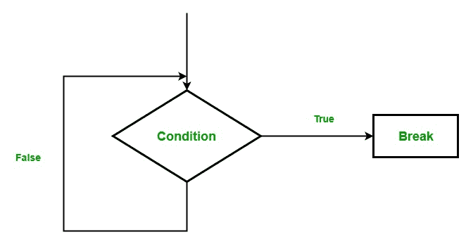

# Scala 中的 Break 语句

> 原文:[https://www.geeksforgeeks.org/break-statement-in-scala/](https://www.geeksforgeeks.org/break-statement-in-scala/)

在 Scala 中，我们使用 *break 语句*来中断程序中循环的执行。Scala 编程语言不包含任何 break 语句的概念(在以上 2.8 版本中)，它提供了一个`**break**` 方法代替 break 语句，用于中断程序或循环的执行。通过导入 **`scala.util.control.breaks._ package`** 使用破法。

**流程图:**


**语法:**

```
// import package
import scala.util.control._

// create a Breaks object 
val loop = new breaks;

// loop inside breakable
loop.breakable{

// Loop starts
for(..)
{
// code
loop.break
}
}

```

或者

```
import scala.util.control.Breaks._
breakable 
{
 for(..)
{
 code..
 break
}
}
```

**例如:**

```
// Scala program to illustrate the 
// implementation of break

// Importing break package
import scala.util.control.Breaks._
object MainObject 
{

// Main method
def main(args: Array[String]) 
{

    // Here, breakable is used to prevent exception 
    breakable 
    { 
        for (a <- 1 to 10) 
        {
            if (a == 6)

                // terminate the loop when 
                // the value of a is equal to 6
                break 
            else
             println(a);
        }
    }
}
}
```

**输出:**

```
1
2
3
4
5
```

**在嵌套循环中断开:**我们也可以在嵌套循环中使用*断开*的方法。

**例如:**

```
// Scala program to illustrate the 
// implementation of break in nested loop

// Importing break package
import scala.util.control._

object Test 
{

// Main method
def main(args: Array[String]) 
{
    var num1 = 0;
    var num2 = 0;
    val x = List(5, 10, 15);
    val y = List(20, 25, 30);

    val outloop = new Breaks;
    val inloop = new Breaks;

    // Here, breakable is used to 
    // prevent from exception
    outloop.breakable 
    { 
        for (num1 <- x) 
        {   

            // print list x
            println(" " + num1);

            inloop.breakable 
            {
            for (num2 <- y) 
            {

            //print list y
            println(" " + num2);

            if (num2 == 25) 
            {

            // inloop is break when 
            // num2 is equal to 25
            inloop.break;
            }
            }

        // Here, inloop breakable
            } 
        }

    // Here, outloop breakable
    } 
}
}
```

**输出:**

```
  5
 20
 25
 10
 20
 25
 15
 20
 25
```

**说明:**在上例中，num1 和 num2 的初始值均为 0。现在，首先外部 for 循环开始并打印 x 列表中的 5，然后内部 for 循环开始工作并打印 y 列表中的 20，25，当控件进入 num2 == 25 条件时，内部循环中断。10 和 15 也是如此。