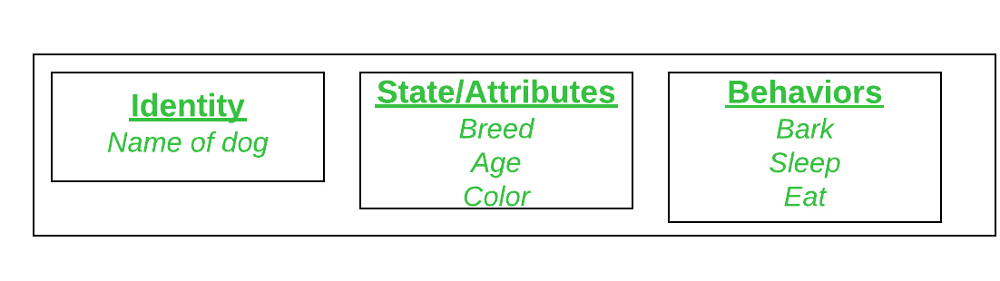
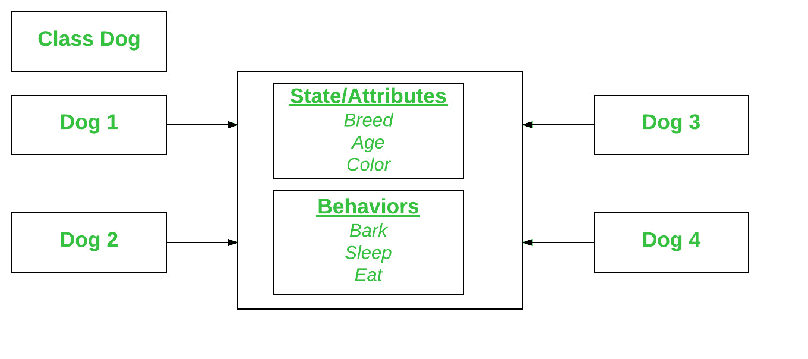
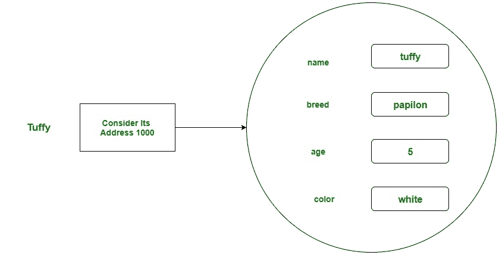

# Scala 中的类和对象

> 原文:[https://www.geeksforgeeks.org/class-and-object-in-scala/](https://www.geeksforgeeks.org/class-and-object-in-scala/)

**类和对象**是面向对象编程的基本概念，围绕着**现实实体**展开。

#### **级**

类是用户定义的蓝图或原型，从中创建对象。或者换句话说，一个类将字段和方法(定义动作的成员函数)组合成一个单元。基本上，在类中，构造函数用于初始化新对象，字段是提供类及其对象状态的变量，方法用于实现类及其对象的行为。

**类的声明**
在 Scala 中，类声明包含 class 关键字，后跟类的标识符(名称)。但是根据应用程序的需求，有一些可选的属性可以与类声明一起使用。一般来说，类声明可以包含这些组件，顺序如下:

*   **关键字类:**类关键字用于声明类型类。
*   **类名:**名称应以首字母(按惯例大写)开头。
*   **超类(如果有的话):**类的父类(超类)的名称，如果有的话，前面加关键字 extends。一个类只能扩展(子类)一个父类。
*   **特征(如果有):**由类实现的以逗号分隔的特征列表，如果有，前面有关键字 extends。一个类可以实现多个特征。
*   **Body:** 类体被{ }包围(花括号)。

**语法:**

```scala
class Class_name{
// methods and fields
}
```

**注意:**类的默认修饰符是 public。

**示例:**

## 斯卡拉

```scala
// A Scala program to illustrate
// how to create a class

// Name of the class is Smartphone
class Smartphone
{

    // Class variables
    var number: Int = 16
    var nameofcompany: String = "Apple"

    // Class method
    def Display()
    {
        println("Name of the company : " + nameofcompany);
        println("Total number of Smartphone generation: " + number);
    }
}
object Main
{

    // Main method
    def main(args: Array[String])
    {

        // Class object
        var obj = new Smartphone();
        obj.Display();
    }
}
```

**输出:**

```scala
Name of the company : Apple
Total number of Smartphone generation: 16
```

#### 目标

它是面向对象编程的基本单元，代表现实生活中的实体。一个典型的 Scala 程序会创建许多对象，正如您所知，这些对象通过调用方法进行交互。一个对象包括:

*   **状态:**由对象的属性表示。它还反映了对象的属性。
*   **行为:**用一个对象的方法来表示。它还反映了一个对象与其他对象的反应。
*   **身份:**它为一个对象赋予唯一的名称，并使一个对象能够与其他对象交互。

将狗视为一个对象，并查看下图的身份、状态和行为。



物体与现实世界中发现的事物相对应。例如，图形程序可以具有诸如“圆形”、“正方形”、“菜单”之类的对象。在线购物系统可能有“购物车”、“顾客”和“产品”等对象。

#### 声明对象(也称为实例化类)

当一个类的对象被创建时，这个类被称为实例化。所有实例共享类的属性和行为。但是这些属性值，即状态对于每个对象都是唯一的。一个类可以有任意数量的实例。



在 Scala 中，类的对象是使用 new 关键字创建的。在 Scala 中创建对象的语法是:

**语法:**

```scala
var obj = new Dog();
```

Scala 还提供了一个名为伴随对象的特性，在这个特性中，您可以创建一个对象，而无需使用新的关键字。

#### 初始化对象

新运算符通过为新对象分配内存并返回对该内存的引用来实例化一个类。新运算符还调用类构造函数。

**示例:**

## 斯卡拉

```scala
// A Scala program to illustrate the
// Initialization of an object

// Class with primary constructor
class Dog(name:String, breed:String, age:Int, color:String )
{
        println("My name is:" + name + " my breed is:" + breed);
        println("I am: " + age + " and my color is :" + color);

}
object Main
{

    // Main method
    def main(args: Array[String])
    {

        // Class object
        var obj = new Dog("tuffy", "papillon", 5, "white");
    }
}
```

**输出:**

```scala
My name is:tuffy my breed is:papillon
I am: 5 and my color is :white
```

**说明:**这个类包含单个构造函数。我们可以识别构造函数，因为在 Scala 中，类的主体是构造函数的主体，参数列表跟在类名后面。Dog 类中的构造函数接受四个参数。下面的语句为这些参数提供了“tuffy”、“papillon”、5、“white”作为值:

```scala
var obj = new Dog("tuffy", "papillon", 5, "white");
```

执行该语句的结果可以说明如下:



#### 匿名对象

匿名对象是实例化但不包含任何引用的对象，当您不想重用它时，可以创建匿名对象。

**示例:**

## 斯卡拉

```scala
// Scala program to illustrate how
// to create an Anonymous object

class GFG
{
    def display()
    {
        println("Welcome! GeeksforGeeks");
    }
}
object Main
{

    // Main method
    def main(args: Array[String])
    {

        // Creating Anonymous object of GFG class
        new GFG().display();
    }
}
```

**输出:**

```scala
Welcome! GeeksforGeeks
```