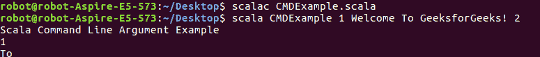
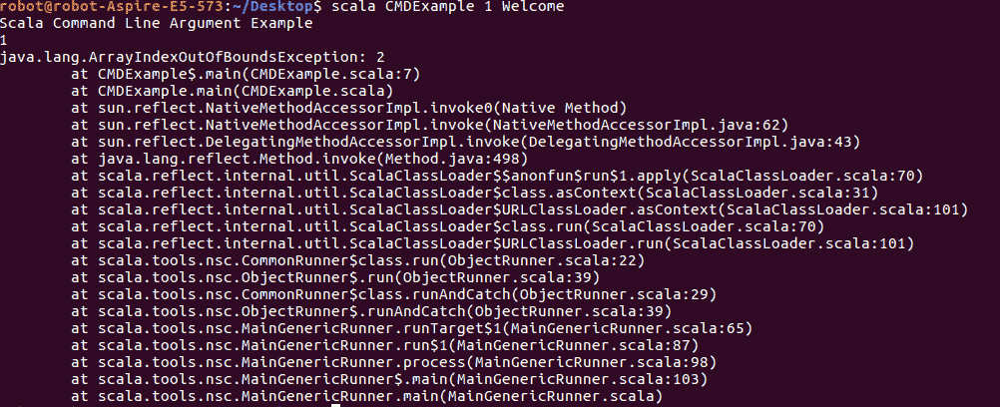

# Scala 中的命令行参数

> 原文:[https://www . geesforgeks . org/命令行参数 in-scala/](https://www.geeksforgeeks.org/command-line-argument-in-scala/)

用户或程序员传递给 **main()** 方法的参数称为命令行参数。main()方法是程序执行的入口点。main()方法接受字符串数组。
*运行时*。但是它从不接受程序中任何其他方法的参数。
**语法:**

```
def main(args: Array[String])
```

使用**参数**数组访问 Scala 命令行参数，当我们扩展应用程序时，该数组是隐式可用的。这里有一个例子。
**示例 1:** 打印所有给定对象

## 斯卡拉

```
// Scala Program on command line argument
object CMDExample
{
    // Main method
    def main(args: Array[String])
    {
        println("Scala Command Line Argument Example");

        // You pass any thing at runtime
        // that will be print on the console
        for(arg<-args)
        {
            println(arg);
        }
    }
}
```

**要在终端上编译和执行上述程序，请遵循以下命令:**
首先保存程序 CMDExample.scala，然后打开 CMD/Terminal，进入保存 scala 程序的目录。

> 编译:scala CMDExample . Scala
> 执行:Scala cmdesample 欢迎来到 GeeksforGeeks！

**输出:**

```
Scala Command Line Argument Example
Welcome
To
GeeksforGeeks!
```


**例 2:** 打印一些运行时给出的对象

## 斯卡拉

```
// Scala Program on command line argument
object CMDExample
{
    // Main method
    def main(args: Array[String])
    {
        println("Scala Command Line Argument Example");

        // You pass any thing at runtime
        // that will be print on the console
        println(args(0));
        println(args(2));
    }
}
```

**要在终端上编译和执行上述程序，请遵循以下命令:**

> 编译:Scala cmdesample . Scala
> 执行:scala CMDExample 1 欢迎来到 GeeksforGeeks！2

**输出:**

```
Scala Command Line Argument Example
1
To
```



**注意:**如果给定的索引在数组中不存在，那么你会发现这个错误

