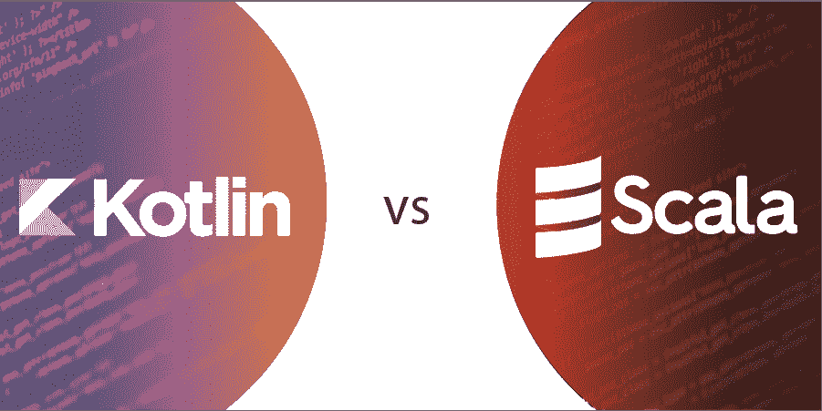

# 柯特林和斯卡拉的区别

> 原文:[https://www . geeksforgeeks . org/kot Lin 和-scala 之间的差异/](https://www.geeksforgeeks.org/difference-between-kotlin-and-scala/)

Scala 可能是一种异常多范例的语言，它可以在任何地方运行，从更好的 Java 到更令人遗憾的 Haskell。这意味着 Scala 库和代码库经常使用各种不同的编码风格，学习使用它们可能需要很长时间。此外，这使得标准化一个组变得更加困难。在 differentiate 中，Kotlin 将距离更远的 Java 与距离更远的 Java 联系在一起，因此库更可靠，可以避免许多这样的问题。Kotlin 拥有真正一致的 Java 互操作。Scala 在某种程度上允许 Java 互操作，但是使用起来确实相当痛苦，因为最著名的 Java 库都有专门为它们编写的 Scala 包装器。科特林得到了喷气大脑的大力赞助，他们制作了一些真正伟大的计算机程序。Scala 现在没有同样集中级别的 back 事实上，TypeSafe 将他们的标题改为 Lightbend，并从 Scala 撤回。对于有 Java 背景的人来说，Kotlin 的记忆速度要快得多。

**[柯特林](https://www.geeksforgeeks.org/kotlin-programming-language/)**
柯特林可能是一个跨平台的、静态编写的、带有排序推演的通用编程方言。Kotlin 计划与 Java 完全互操作，其标准库的 JVM 形式依赖于 Java 课程库，但排序归纳允许其语言结构更简短。在安卓系统中运行良好。在安卓系统中设置很简单(安卓工作室中的 gradle 记录有很多行)。让 Scala 在安卓系统中工作的习惯要多得多，事实上，在这一点上，有一些事情(表演艺术家)没有被掩盖。我们正处于 IOT 叛乱的开端，安卓占据了最前沿，因此在最著名的便携式舞台上拥有一种最前沿且 100%一致的方言是关键。

**[【Scala】](https://www.geeksforgeeks.org/scala-programming-language/)**
Scala 可能是一种通用的编程方言，为有用的编程和可靠的非活动排序框架提供了回报。简单地说，Scala 的许多计划选择都指向解决 Java 的反应。Scala 可能是当今的多范例编程方言，它是面向对象和有用编程的结合。它是高度可扩展的，这就是为什么它被称为 Scala。Scala 编程可能是一种通用计算机语言，在更大范围内支持面向对象和实用的编程风格。Scala 可能是一种强静态类型的编程方言，并且受到 Java 编程方言的影响。Scala 和 Java 之间最好的相似之处之一是，您可以像编写 Java 一样编写 Scala 代码。除了许多第三方库之外，还可以利用 Scala 中的一部分 Java 库。

**科特林 vs 斯卡拉的区别**

| 我的锅 | 斯卡拉 |
| --- | --- |
| 本质上是面向对象的方言 | 多范例编程方言 |
| 图书馆、博客和直播间越来越少，换句话说，支持社区的措施越来越少。 | 与科特林相比，社区支撑更大。 |
| 科特林代码通常很简短，过于紧凑。 | Scala 代码通常更大。 |
| Kotlin 是一种官方的安卓方言 | Scala 并没有被安卓系统激烈利用 |
| 柯特林并不完全支持设计协调。 | 图案协调、宏和高级形状的总支撑 |
| 实用性以及商业层面的一致性。 | 海量信息——海量、滔滔不绝。 |