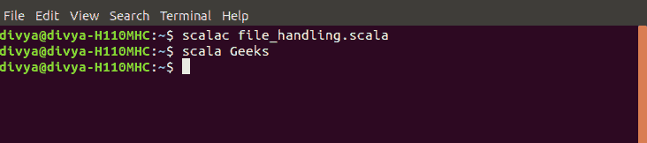
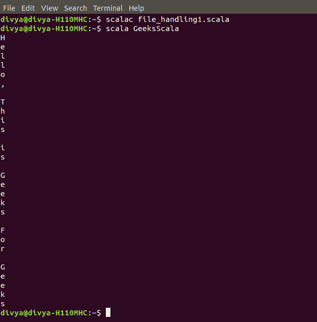
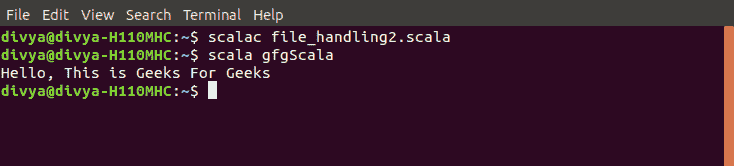

# Scala 中的文件处理

> 原文:[https://www.geeksforgeeks.org/file-handling-in-scala/](https://www.geeksforgeeks.org/file-handling-in-scala/)

**文件处理**是将提取的信息存储在文件中的一种方式。Scala 提供了包，我们可以从中创建、打开、读取和写入文件。为了在 scala 中写入文件，我们从 java 中借用 java.io._ 因为在 Scala 标准库中，我们没有可以写入文件的类。我们还可以导入 java.io.File 和 java.io.PrintWriter。

> **创建新文件:**
> 
> 1.  *java.io.File* 定义了 JVM 访问文件、文件系统和属性的类和接口。
> 2.  *文件(字符串路径名)*将参数字符串转换为抽象路径名，创建一个新的文件实例。
> 
> **写入文件**
> 
> 1.  *java.io.PrintWriter* 包括 PrintStream 中包含的所有打印方法。

下面是创建一个新文件并写入其中的实现。

```
// File handling program
import java.io.File
import java.io.PrintWriter

// Creating object
object Geeks
{
    // Main method
    def main(args:Array[String])
    {
        // Creating a file 
        val file_Object = new File("abc.txt" ) 

        // Passing reference of file to the printwriter     
        val print_Writer = new PrintWriter(file_Object) 

        // Writing to the file       
        print_Writer.write("Hello, This is Geeks For Geeks") 

        // Closing printwriter    
        print_Writer.close()       
}
}     
```


创建一个文本文件 abc.txt，包含字符串“你好，这里是极客为极客准备的极客”

Scala 不提供写文件的类，但是它提供读文件的类。这是源类。我们使用它的伴随对象来读取文件。为了读取这个文件的内容，我们调用类 Source 的 fromFile()方法来读取包含文件名作为参数的文件内容。

> **读取文件**
> *scala.io.Source* 包括源文件的可迭代表示方法。
> *源文件*从输入文件创建一个源文件。
> *file.next* 返回迭代中的下一个元素，并将迭代器向前移动一步。
> *file.hasnext* 检查是否有下一个可迭代的元素。
> *获取行*–逐行迭代文件

下面是从文件中读取每个字符的实现。

```
// Scala File handling program
import scala.io.Source

// Creating object 
object GeeksScala
{
    // Main method
    def main(args : Array[String])
    {
        // file name
        val fname = "abc.txt" 

        // creates iterable representation 
        // of the source file            
        val fSource = Source.fromFile(fname) 
        while (fSource.hasNext)
        {
            println(fSource.next)
        }

        // closing file
        fSource.close() 
    }
}
```

**输出:**

我们可以使用 getLines()方法一次性读取单个行，而不是整个文件。
下面是从文件中读取每一行的实现。

```
// Scala file handling program to Read each
// line from a single file
import scala.io.Source 

// Creating object
object gfgScala
{ 
    // Main method
    def main(args:Array[String])
    { 
        val fname = "abc.txt"
        val fSource = Source.fromFile(fname) 
        for(line<-fSource.getLines)
        { 
            println(line) 
        } 
        fSource.close() 
    } 
} 
```

**输出:**
