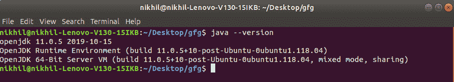
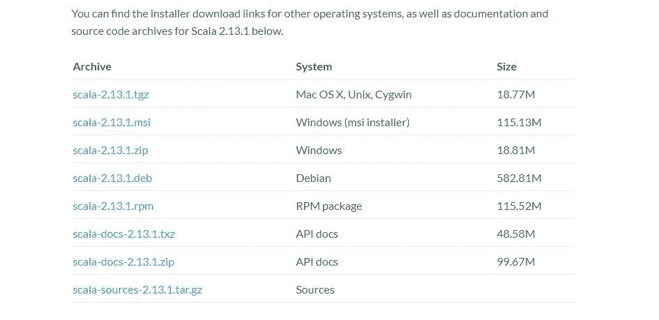
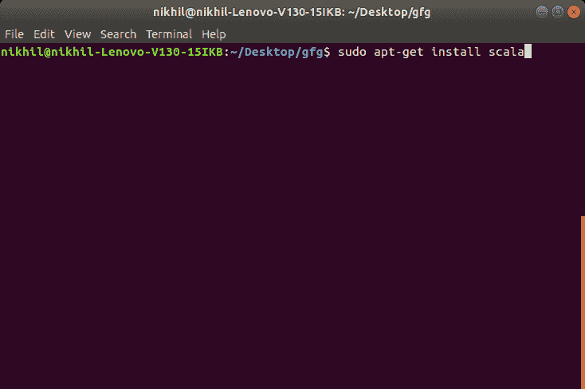
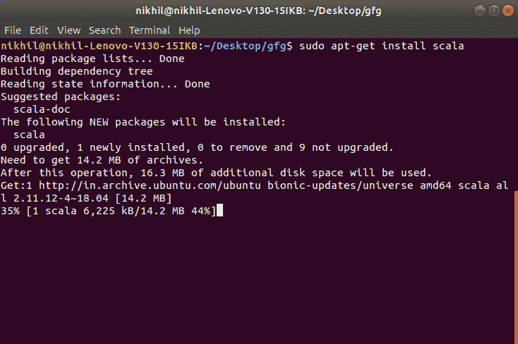
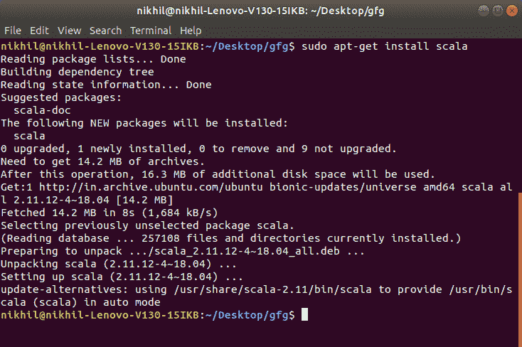
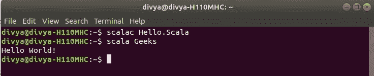

# 如何在 Linux 中安装 Scala？

> 原文:[https://www . geeksforgeeks . org/如何在 linux 中安装 Scala/](https://www.geeksforgeeks.org/how-to-install-scala-in-linux/)

**先决条件:**[Scala 简介](https://www.geeksforgeeks.org/introduction-to-scala/)

之前，我们从在系统上安装 Scala 的过程开始。我们必须对什么是 Scala 语言以及它实际上做什么有第一手的了解。Scala 是一种通用、高级、多范式的编程语言。它是一种纯面向对象的编程语言，也为函数式编程方法提供了支持。在 Scala 中，没有原始数据的概念，因为一切都是对象。它旨在以精炼、简洁和类型安全的方式表达一般的编程模式。Scala 程序可以转换成字节码，可以在 [**JVM**](https://www.geeksforgeeks.org/jvm-works-jvm-architecture/) (Java 虚拟机)上运行。Scala 代表*可扩展*语言。它还提供了 [**Javascript**](https://www.geeksforgeeks.org/how-to-be-a-javascript-developer-without-knowing-javascript/) 运行时。Scala 深受 Java 和其他编程语言的影响，如 Lisp、Haskell、Pizza 等。
Scala 是一种非常兼容的语言，因此可以非常容易地安装到 Linux 操作系统中。最基本的要求是，我们的计算机上必须安装 Java 1.8 或更高版本。

**验证 Java 包:**
我们首先需要在电脑上安装一个 Java 软件开发工具包(SDK)。我们需要验证这些软件开发工具包，如果没有安装，那么安装它们。只需到**终端**运行以下命令:

```
java --version 
```

执行此命令后，输出将显示 java 版本，输出如下:

如果我们没有安装 SDK，请使用以下命令根据计算机要求下载最新版本:

```
sudo apt-get install default-jdk
```

### 下载和安装 Scala:

**下载 Scala:**
在开始安装过程之前，需要先下载。为此，所有版本的 Scala 都可以在[scala-lang.org](https://www.scala-lang.org/download/)

上获得。下载 Scala 并按照进一步的说明安装 Scala。但是，您可以使用以下命令轻松地在 Ubuntu 上安装最新版本的 Scala:

```
sudo apt-get install scala
```

**从安装开始:**

*   **入门:**
    
*   **开始安装过程:**
    
*   **安装完毕:**
    

完成安装过程后，可以使用任何集成开发环境或文本编辑器编写 Scala 代码，并使用以下命令在集成开发环境或终端上运行这些代码:

```
scalac file_name.Scala
scala class_name
```

这里有一个示例程序，从使用 **Scala 编程**开始:
让我们考虑一个简单的 Hello World 程序。

```
// Scala program to print Hello World!  
object Geeks  
{ 
    // Main Method  
    def main(args: Array[String])  
    { 
        // prints Hello World 
        println("Hello World!")  
    } 
} 
```

**Output:**