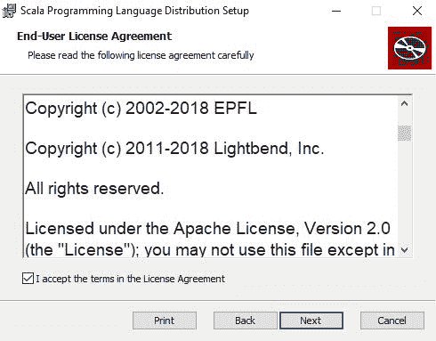
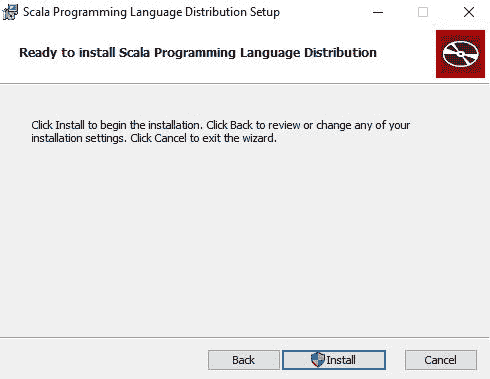
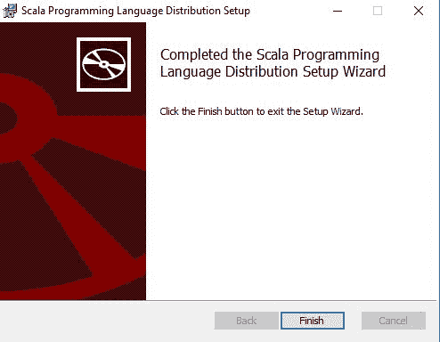

# 如何在 Windows 上安装 Scala？

> 原文:[https://www . geeksforgeeks . org/如何在 windows 中安装 Scala/](https://www.geeksforgeeks.org/how-to-install-scala-in-windows/)

**先决条件:**[Scala 简介](https://www.geeksforgeeks.org/introduction-to-scala/)

在开始在我们的系统上安装 Scala 的过程之前，我们必须对 Scala 语言是什么以及它实际上是做什么的有第一手的了解。Scala 是一种通用、高级、多范式的编程语言。它是一种纯面向对象的编程语言，也为函数式编程方法提供了支持。在 Scala 中，没有原始数据的概念，因为一切都是对象。它旨在以精炼、简洁和类型安全的方式表达一般的编程模式。Scala 程序可以转换成字节码，可以在 [**JVM**](https://www.geeksforgeeks.org/jvm-works-jvm-architecture/) (Java 虚拟机)上运行。Scala 代表*可扩展*语言。它还提供了 [**Javascript**](https://www.geeksforgeeks.org/how-to-be-a-javascript-developer-without-knowing-javascript/) 运行时。Scala 深受 Java 和其他编程语言的影响，如 Lisp、Haskell、Pizza 等。
Scala 是一种非常兼容的语言，因此可以非常容易地安装到窗口中。最基本的要求是，我们的计算机上必须安装 Java 1.8 或更高版本。

**验证 Java 包:**
我们首先需要在电脑上安装一个 Java 软件开发工具包(SDK)。我们需要验证这个软件开发工具包包，如果没有安装，然后安装它们。只需转到**命令行**(对于**窗口**，在运行对话框中搜索**cmd**(<link rel="stylesheet" href="https://maxcdn.bootstrapcdn.com/font-awesome/4.6.1/css/font-awesome.min.css">***+R**)。
现在运行以下命令:*

```scala
*java -version* 
```

*一旦该命令被执行，输出将显示 java 版本，输出如下:

如果我们没有安装 SDK，那么根据计算机要求从[oracle.com](https://www.oracle.com/technetwork/java/javase/downloads/jdk12-downloads-5295953.html)下载最新版本，然后继续安装。*

### *下载和安装 Scala:*

***下载 Scala:**
在开始安装过程之前，需要先下载。为此，所有版本的 Windows Scala 都可以在[scala-lang.org](https://www.scala-lang.org/download/)

上获得。下载 Scala 并按照进一步的说明安装 Scala。*

***从安装开始:***

*   ***入门:**
    *
*   ***完成用户许可协议:**
    *
*   ***继续安装**
    *
*   ***安装流程:**
    *
*   ***安装完毕:**
    *

*完成安装过程后，可以使用任何集成开发环境或文本编辑器编写 Scala 代码，并使用命令在集成开发环境或命令提示符下运行它们:*

```scala
*scalac file_name.Scala
scala class_name*
```

*这里有一个示例程序，从使用 **Scala 编程**开始:
让我们考虑一个简单的 Hello World 程序。*

```scala
*// Scala program to print Hello World!  
object Geeks  
{ 
    // Main Method  
    def main(args: Array[String])  
    { 
        // prints Hello World 
        println("Hello World!")  
    } 
} *
```

***Output:***