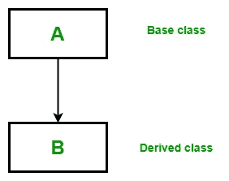
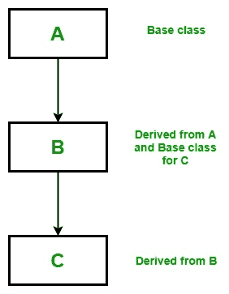
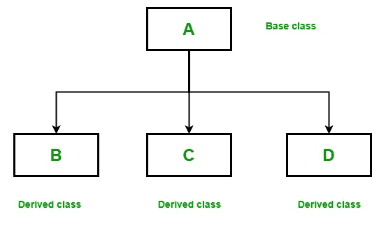
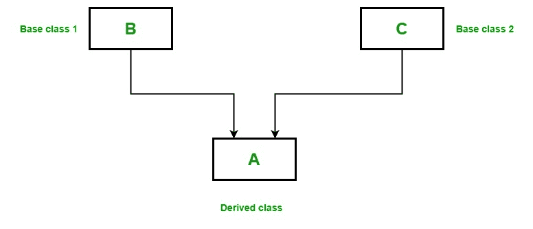

# Scala 中的继承

> 原文:[https://www.geeksforgeeks.org/inheritance-in-scala/](https://www.geeksforgeeks.org/inheritance-in-scala/)

继承是面向对象编程的重要支柱。这是 Scala 中允许一个类继承另一个类的特性(字段和方法)的机制。
**重要术语:**

*   **超类:**特征被继承的类称为超类(或基类或父类)。
*   **子类:**继承另一个类的类称为子类(或派生类、扩展类或子类)。除了超类字段和方法之外，子类还可以添加自己的字段和方法。
*   **可重用性:**继承支持“可重用性”的概念，即当我们想要创建一个新的类，并且已经有一个类包含了我们想要的一些代码时，我们可以从现有的类中派生出我们的新类。通过这样做，我们重用了现有类的字段和方法。

#### 如何在 Scala 中使用继承

用于继承的关键字是**扩展**。
**语法:**

```scala
class parent_class_name extends child_class_name{
// Methods and fields
}
```

**示例:**

```scala
// Scala program to illustrate the 
// implementation of inheritance

// Base class
class Geeks1{
    var Name: String = "Ankita"
}

// Derived class
// Using extends keyword 
class Geeks2 extends Geeks1
{
    var Article_no: Int = 130

    // Method
    def details()
    {
    println("Author name: " +Name);
    println("Total numbers of articles: " +Article_no);
    }
}

object Main 
{

    // Driver code
    def main(args: Array[String]) 
    {

        // Creating object of derived class
        val ob = new Geeks2();
        ob.details();
    }
}
```

**输出:**

```scala
Author name: Ankita
Total numbers of articles: 130

```

**说明:**在上例中，Geeks1 是基类，Geeks2 是派生类，使用 extends 关键字从 Geeks1 派生而来。在主方法中，当我们创建 Geeks2 类的对象时，基类的所有方法和字段的副本都会在该对象中获取内存。这就是为什么通过使用派生类的对象，我们也可以访问基类的成员。

#### 继承类型

下面是 Scala 支持的不同类型的继承。

*   **Single Inheritance:** In single inheritance, derived class inherits the features of one base class. In the image below, class A serves as a base class for the derived class B.
    
    **Example:**

    ```scala
    // Scala program to illustrate the 
    // Single inheritance

    // Base class
    class Parent
    {
        var Name: String = "Ankita"
    }

    // Derived class
    // Using extends keyword 
    class Child extends Parent
    {
        var Age: Int = 22

        // Method
        def details()
        {
        println("Name: " +Name);
        println("Age: " +Age);
        }
    }

    object Main
    {

        // Driver code
        def main(args: Array[String]) 
        {

            // Creating object of the derived class
            val ob = new Child();
            ob.details();
        }
    }
    ```

    **输出:**

    ```scala
    Name: Ankita
    Age: 22

    ```

*   **Multilevel Inheritance:** In Multilevel Inheritance, a derived class will be inheriting a base class and as well as the derived class also act as the base class to another class. In the below image, the class A serves as a base class for the derived class B, which in turn serves as a base class for the derived class C.
    
    **Example:**

    ```scala
    // Scala program to illustrate the 
    // Multilevel inheritance

    // Base class
    class Parent
    {
        var Name: String = "Soniya"
    }

    // Derived from parent class
    // Base class for Child2 class
    class Child1 extends Parent
    {
        var Age: Int = 32
    }

    // Derived from Child1 class
    class Child2 extends Child1
    {
        // Method
        def details(){
        println("Name: " +Name);
        println("Age: " +Age);
        }
    }

    object Main
    {

        // Drived Code
        def main(args: Array[String]) 
        {

            // Creating object of the derived class
            val ob = new Child2();
            ob.details();
        }
    }
    ```

    **输出:**

    ```scala
    Name: Soniya
    Age: 32

    ```

*   **Hierarchical Inheritance:** In Hierarchical Inheritance, one class serves as a superclass (base class) for more than one subclass.In below image, class A serves as a base class for the derived class B, C, and D.
    
    **Example:**

    ```scala
    // Scala program to illustrate the 
    // Hierarchical inheritance

    // Base class
    class Parent
    {
        var Name1: String = "Siya"
        var Name2: String = "Soniya"
    }

    // Derived from the parent class
    class Child1 extends Parent
    {
        var Age: Int = 32
        def details1()
        {
        println(" Name: " +Name1);
        println(" Age: " +Age);
        }
    }

    // Derived from Parent class
    class Child2 extends Parent
    {
        var Height: Int = 164

        // Method
        def details2()
        {
        println(" Name: " +Name2);
        println(" Height: " +Height);
        }
    }

    object Main 
    {

        // Driver code
        def main(args: Array[String]) 
        {

            // Creating objects of both derived classes
            val ob1 = new Child1();
            val ob2 = new Child2();
            ob1.details1();
            ob2.details2();
        }
    }
    ```

    **输出:**

    ```scala
     Name: Siya
     Age: 32
     Name: Soniya
     Height: 164

    ```

*   **Multiple Inheritance:** In Multiple inheritance ,one class can have more than one superclass and inherit features from all parent classes. Scala does not support multiple inheritance with classes, but it can be achieved by traits.
    
    **Example:**

    ```scala
    // Scala program to illustrate the 
    // multiple inheritance using traits

    // Trait 1
    trait Geeks1
    {
        def method1()
    }

    // Trait 2
    trait Geeks2
    {
        def method2()
    }

    // Class that implement both Geeks1 and Geeks2 traits
    class GFG extends Geeks1 with Geeks2
    {

        // method1 from Geeks1
        def method1()
        {
            println("Trait 1");
        }

        // method2 from Geeks2
        def method2()
        {
            println("Trait 2");
        }
    }
    object Main 
    {
        // Driver code
        def main(args: Array[String])
        {

            // Creating object of GFG class
            var obj = new GFG();
            obj.method1();
            obj.method2();
        }
    }
    ```

    **输出:**

    ```scala
    Trait 1
    Trait 2

    ```

*   **杂交遗传:**是上述两种或两种以上遗传类型的混合。因为 Scala 不支持类的多重继承，所以类的混合继承也是不可能的。在 Scala 中，我们只能通过性状来实现混合遗传。
    T3】