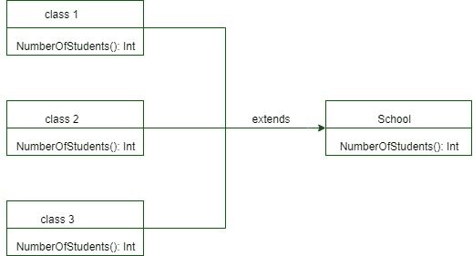

# Scala 中的方法覆盖

> 原文:[https://www.geeksforgeeks.org/method-overriding-in-scala/](https://www.geeksforgeeks.org/method-overriding-in-scala/)

Scala 中的**方法覆盖**与 Java 中的[方法覆盖](https://www.geeksforgeeks.org/overriding-in-java/)相同，但是在 Scala 中，覆盖特性在这里被进一步阐述，两种方法以及 *var* 或 *val* 都可以被覆盖。如果一个子类的方法名与父类中定义的方法名相同，那么它就是*方法覆盖*，即被声明的超类继承的子类，利用*覆盖*关键字覆盖超类中定义的方法。

**Flow chart of method overriding**

让我们看看方法重写的流程图，以便显式地可视化它。

这里，在上面的图中*学校*是其中定义了一个方法的超级班级，该方法被命名为 *NumberOfStudents()* 并且该方法被子班级即 1 班、2 班、3 班覆盖。因此，所有子类都有与超类中定义的相同的命名方法。

**When to apply Method Overriding ?**

当一个子类希望为父类中定义的方法提供一个特定的实现时，该子类将覆盖父类中定义的方法。当我们希望重构在超类中定义的方法时，我们可以应用方法重写。
我们来看一个与上面提到的方法覆盖图相关的例子。

**示例:**

```
// Scala program of method overriding

// Creating a super class
class School
{ 

    // Method defined
    def NumberOfStudents()=
    { 
        0 // Utilized for returning an Integer
    } 
} 

// Creating a subclass 
class class_1 extends School
{

    // Using Override keyword
    override def NumberOfStudents()=
    { 
        30
    } 
} 

// Creating a subclass 
class class_2 extends School
{ 

    // Using override keyword 
    override def NumberOfStudents()=
    { 
        32
    } 
} 

// Creating a subclass
class class_3 extends School
{ 

    // Using override keyword
    override def NumberOfStudents()=
    { 
        29
    } 
} 

// Creating object 
object GfG
{ 

    // Main method
    def main(args:Array[String])
    { 

        // Creating instances of all
        // the sub-classes
        var x=new class_1() 
        var y=new class_2() 
        var z=new class_3()

        // Displays number of students in class_1
        println("Number of students in class 1 : " + 
                                x.NumberOfStudents()) 

        // Displays number of students in class_2
        println("Number of students in class 2 : " + 
                                y.NumberOfStudents())

        // Displays number of students in class_3
        println("Number of students in class 3 : " +
                                z.NumberOfStudents()) 

    } 
} 
```

**Output:**

```
Number of students in class 1 : 30
Number of students in class 2 : 32
Number of students in class 3 : 29

```