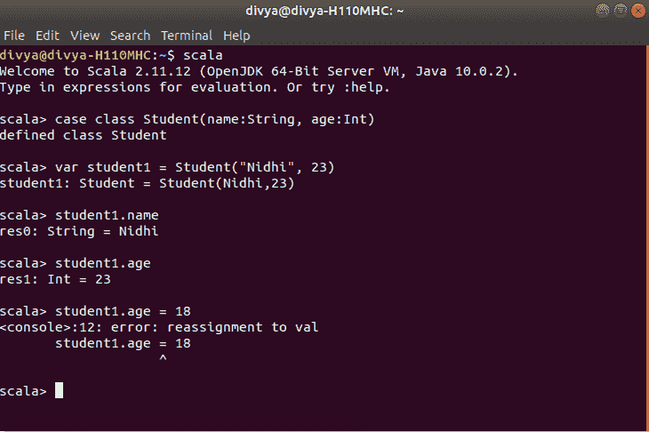

# Scala |案例类和案例对象

> 原文:[https://www . geesforgeks . org/Scala-case-class-and-case-object/](https://www.geeksforgeeks.org/scala-case-class-and-case-object/)

**案例类解释**
A **案例类**就像一个常规类，有一个对不变数据建模的特点。它在模式匹配中也是有建设性的。已经用修饰符 **case** 定义了，由于这个 case 关键字，我们可以得到一些好处来阻止自己做一段代码，这些代码必须包含在许多地方，很少或没有改变。正如我们在下面看到的，最小案例类需要关键字**案例类**、一个标识符和一个可能为空的参数列表。
**语法:**

```
Case class className(parameters)
```

**注意:**Case 类有一个默认的 apply()方法，管理对象的构造。

**格对象的解释**
A **格对象**也像一个对象，比普通对象有更多的属性。它是案例类和对象的混合。案例对象比常规对象有更多的特征。
下面两个是格对象的重要特征:

*   它是可序列化的。
*   默认情况下，它有一个 hashCode 实现。

**示例:**

```
// Scala program of case class and case Object
case class employee (name:String, age:Int)
object Main 
{ 
    // Main method
    def main(args: Array[String]) 
    { 
        var c = employee("Nidhi", 23)

        // Display both Parameter 
        println("Name of the employee is " + c.name); 
        println("Age of the employee is " + c.age); 
    } 
} 
```

**Output:**

```
Name of the employee is Nidhi
Age of the employee is 23

```

**案例类/对象的一些好处**

*   Case Class 最大的好处之一是 Scala 编译器会用类定义中定义的相同数量的参数来附加一个方法，因为即使没有关键字 **new** ，您也可以创建 Case Class 的对象。
    **例:**

    ```
    // Scala program of case class and case Object
    // affix a method with the name of the class
    case class Book (name:String, author:String)
    object Main
    {
        // Main method
        def main(args: Array[String])
        {
            var Book1 = Book("Data Structure and Algorithm", "cormen")
            var Book2 = Book("Computer Networking", "Tanenbaum")

            // Display strings
            println("Name of the Book1 is " + Book1.name);
            println("Author of the Book1 is " + Book1.author);
            println("Name of the Book2 is " + Book2.name);
            println("Author of the Book2 is " + Book2.author);
        }
    } 
    ```

    **输出:**

    ```
    Name of the Book1 is Data Structure and Algorithm
    Author of the Book1 is cormen
    Name of the Book2 is Computer Networking
    Author of the Book2 is Tanenbaum

    ```

*   第二个便利是，默认情况下，Scala 编译器会为构造函数的所有参数添加 **val** 或 **var** ，因此，一旦构造了类对象，我们将无法为它们重新分配新值，这就是为什么即使没有 val 或 var，case 类的构造函数参数也会变成类成员，这对于常规类是不可行的。
    **例:**
    
    由此可见，改派不可行。
*   The Scala compiler also appends a copy() method to case class that is utilized to create a duplicate of the same object with changing some parameters or without altering them.
    **Example :** To create a duplicate of same instance without altering the parameters.

    ```
    // Scala program of case class To create 
    // a duplicate of same instance
    case class Student (name:String, age:Int)
    object Main
    {
        // Main method
        def main(args: Array[String])
        {
            val s1 = Student("Nidhi", 23)

            // Display parameter
            println("Name is " + s1.name);
            println("Age is " + s1.age);
            val s2 = s1.copy()

            // Display copied data
            println("Copy Name " + s2.name);
            println("Copy Age " + s2.age);
        }
    } 
    ```

    **Output:**

    ```
    Name is Nidhi
    Age is 23
    Copy Name Nidhi
    Copy Age 23

    ```

    在这里，我们通过在 s1 对象上使用复制方法创建了新的对象 s2，而不改变 s1 对象的属性。
    **示例:**创建具有变化属性的相同对象的副本。

    ```
    // Scala program of case class same object 
    // with changing attributes
    case class Student (name:String, age:Int)

    object Main
    {
        // Main method
        def main(args: Array[String])
        {
            val s1 = Student("Nidhi", 23)

            // Display parameter
            println("Name is " + s1.name);
            println("Age is " + s1.age);
            val s2 = s1.copy(age = 24)

            // Display copied and changed attributes
            println("Copy Name is " + s2.name);
            println("Change Age is " + s2.age);
        }
    } 
    ```

    **Output:**

    ```
    Name is Nidhi
    Age is 23
    Copy Name is Nidhi
    Change Age is 24

    ```

    这里，您需要在 copy 方法中传递该值。

*   默认情况下，Scala 编译器会添加 toString、equals 方法、带有 apply 和 unapply 方法的伴随对象，因此您不需要 **new** 关键字来构造 Case 类的对象。

**注意:**在 scala 用例类中使用超过 22 个参数是不可行的，但是现在你可以使用 **Scala 版本 2.11.1 在用例类中使用任意数量的参数。**这个限制在这个版本的 scala 中被消除了。