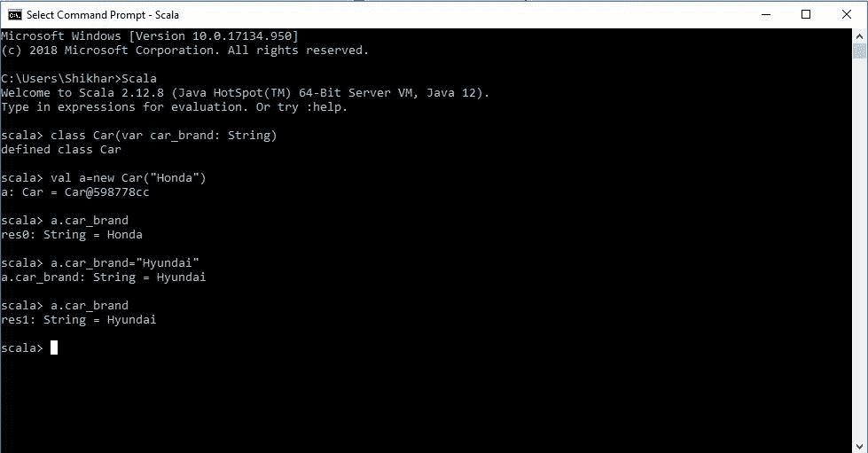
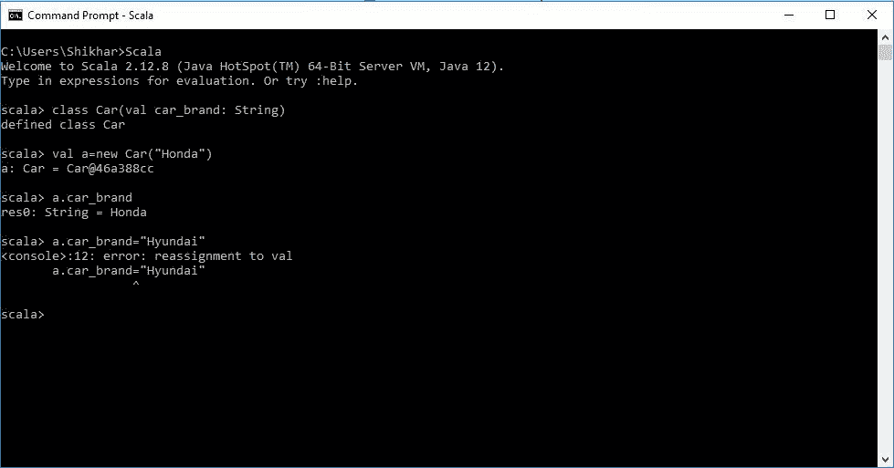
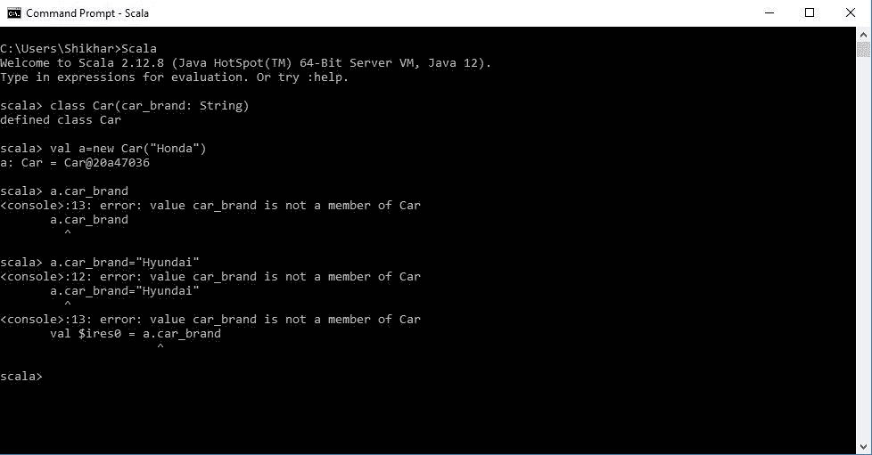
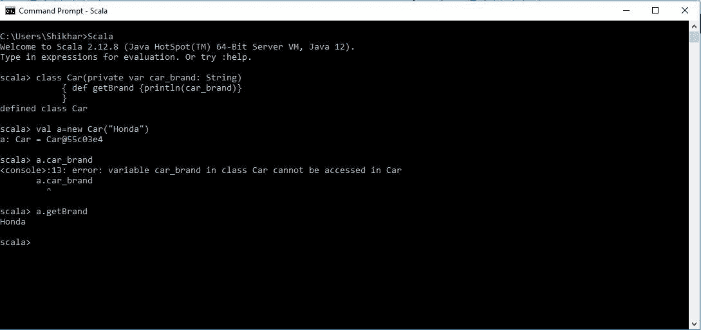

# Scala |控制构造函数字段的可见性

> 原文:[https://www . geesforgeks . org/Scala-控制-构造函数-字段的可见性/](https://www.geeksforgeeks.org/scala-controlling-visibility-of-constructor-fields/)

Scala 语言中*构造函数字段*的可见性是通过声明的方式来维护和控制的。这些可以通过以下形式声明:

*   声明为*值*
*   声明为 *var*
*   声明没有 *var* 和*var*
*   在字段中添加 *Private* 。

现在，我们将通过更多细节和一些示例的帮助来了解上述所有方法:

### 当字段声明为*变量*时

如果该字段被声明为 var，那么 Scala 语言会自动为该特定字段生成 **Getter** 和 **Setter** 模式。这意味着该字段的值始终可以更改。
**例 1:**

### 当字段被声明为*值*时

如果字段被声明为 val，那么在开始中分配的字段的值不能被改变并且永久保持设置。在这种情况下，Scala 只允许 getter 方法。
**例 2:**

### 当字段声明没有*值*和*值*时

如果声明的字段没有 var 和 val，那么字段的可见性就会受到很大的限制，Scala 不允许 setter 和 getter 方法。视野变得受限。
**例 3:**

### 添加关键字 Private

除了 **var** 和 **val** 模式之外，我们还可以提到关键词“private”。这使得字段的可访问性与我们在 C++中的方式相同。这将停止 getter 和 setter 方法，并且通常使用类的成员函数来访问该字段。

**例 4:**

因此，上面讨论的情况是 Scala 构造器类中可能存在的不同类型的可见性模式。