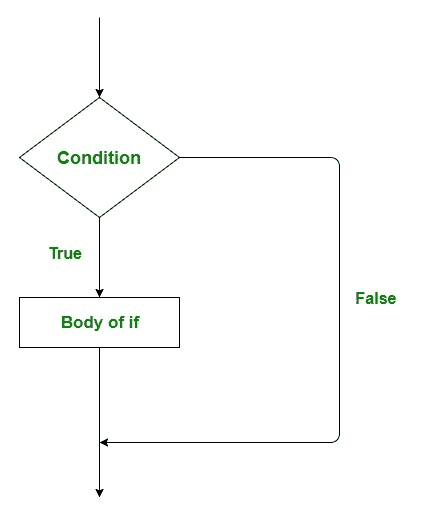
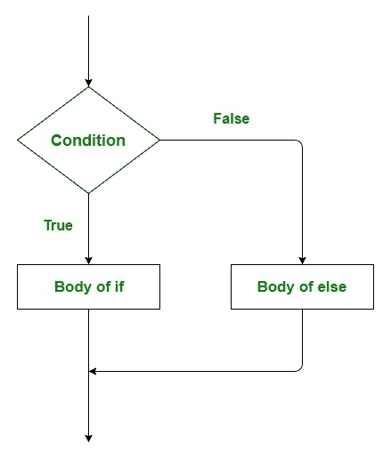
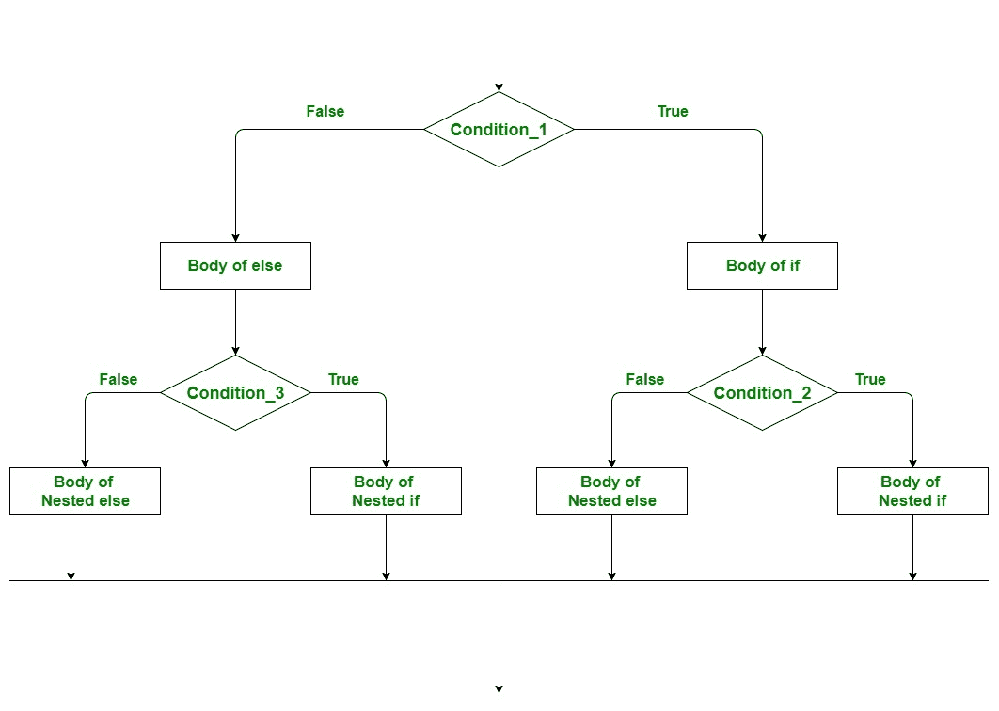
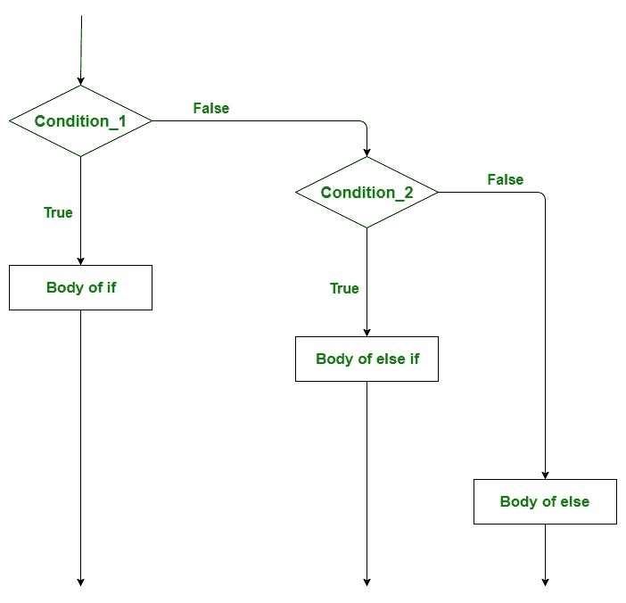

# Scala |决策(if，if-else，Nested if-else，if-else)

> 原文:[https://www . geesforgeks . org/Scala-决策-if-if-else-嵌套-if-if-else-if/](https://www.geeksforgeeks.org/scala-decision-making-if-if-else-nested-if-else-if-else-if/)

编程中的决策类似于现实生活中的决策。在决策过程中，当满足给定的条件时，执行一段代码。有时这些也被称为控制流语句。 [Scala](https://www.geeksforgeeks.org/introduction-to-scala/) 根据一定的条件，使用控制语句来控制程序的执行流程。这些用于使执行流程前进，并根据程序状态的变化进行转移。

**Scala 的条件语句有:**

#### 如果语句

“ **if** ”语句是所有决策语句中最简单的决策语句。在此语句中，只有当给定条件为真时，代码块才会被执行，如果条件为假，则该代码块不会被执行。

**语法:**

```scala
if(condition)
{
    // Code to be executed 
}

```

这里，评估后的**条件**不是真就是假。如果语句接受布尔值——如果值为真，则它将执行其下的语句块。
如果我们没有在 **if(条件)**之后提供花括号“{”和“}”，那么默认情况下 If 语句将认为紧接的 one 语句在其块内。
**例:**

```scala
if(condition)
   statement1;
   statement2;

// Here if the condition is true, if block 
// will consider only statement1 to be inside 
// its block.

```

**流程图:**

[](https://media.geeksforgeeks.org/wp-content/uploads/if-statement-2.jpg)

**示例:**

```scala
// Scala program to illustrate the if statement
object Test {

// Main Method
def main(args: Array[String]) {

    // taking a variable
    var a: Int = 50

    if (a > 30) 
    {

        // This statement will execute as a > 30
        println("GeeksforGeeks")
    }
}
}
```

**输出:**

```scala
GeeksforGeeks
```

#### if-else 语句

if 语句单独告诉我们，如果条件为真，它将执行一组语句，如果条件为假，它不会执行。但是如果条件是假的，我们想做别的事情怎么办。接下来是 else 语句。当条件为假时，我们可以使用 else 语句和 if 语句来执行一段代码。

**语法:**

```scala
if (condition)
{
    // Executes this block if
    // condition is true
}

else
{
    // Executes this block if
    // condition is false
}

```

**流程图:**

[](https://media.geeksforgeeks.org/wp-content/uploads/if-else-statement.jpg)

**示例:**

```scala
// Scala program to illustrate the if-else statement
object Test {

// Main Method
def main(args: Array[String]) {

    // taking a variable
    var a: Int = 650

    if (a > 698) 
    {

        // This statement will not 
        // execute as a > 698 is false
        println("GeeksforGeeks")
    }

    else
    {

        // This statement will execute
        println("Sudo Placement")
    }
}
}
```

**输出:**

```scala
Sudo Placement
```

#### 嵌套 if-else 语句

一个*嵌套 if* 是一个 *if 语句*，这是另一个 *if-else* 语句的目标。嵌套的 *if-else* 语句是指 if 语句或 else 语句中的 *if-else* 语句。Scala 允许我们在 *if-else* 语句中嵌套 *if-else* 语句。

**语法:**

```scala
// Executes when condition_1 is true
if (condition_1) 
{

   if (condition_2) 
   {

      // Executes when condition_2 is true
   }

  else
  {

     // Executes when condition_2 is false
  }

}

// Executes when condition_1 is false
else
{

   if (condition_3) 
   {

      // Executes when condition_3 is true
   }

  else
  {

     // Executes when condition_3 is false
  }

}

```

**流程图:**

[](https://media.geeksforgeeks.org/wp-content/uploads/Nested-If-else.jpg)

**示例:**

```scala
// Scala program to illustrate 
// the nested if-else statement
object Test {

// Main Method
def main(args: Array[String]) {

    // taking three variables
    var a: Int = 70
    var b: Int = 40
    var c: Int = 100

    // condition_1
    if (a > b) 
    {
        // condition_2
        if(a > c)
        {
            println("a is largest");
        }

        else
        {
            println("c is largest")
        }

    }

    else
    {

         // condition_3
        if(b > c)
        {
            println("b is largest")
        }

        else
        {
            println("c is largest")
        }
    }
}
}
```

**输出:**

```scala
c is largest
```

#### 如果-如果梯子

在这里，用户可以在多个选项中进行选择。从上到下执行 *if* 语句。一旦控制*的条件之一*为真，则执行与该*关联的语句*，并绕过梯子的其余部分。如果所有条件都不成立，则执行最终的*否则*语句。

**语法:**

```scala
if(condition_1)
{

     // this block will execute 
     // when condition_1 is true
}

else if(condition_2)
{

    // this block will execute 
    // when condition2 is true
}
.
.
.

else 
{

      // this block will execute when none
     // of the condition is true
}

```

**流程图:**

[](https://media.geeksforgeeks.org/wp-content/uploads/If-Else-if-Ladder.jpg)

**示例:**

```scala
// Scala program to illustrate 
// the if-else-if ladder 
object Test {

// Main Method    
def main(args: Array[String]) {

    // Taking a variable
    var value: Int = 50

    if (value == 20) 
    {

        // print "value is 20" when 
        // above condition is true
        println("Value is 20")
    } 

    else if (value == 25) 
    {

        // print "value is 25" when 
        // above condition is true
        println("Value is 25")
    } 

    else if (value == 40)
    {

        // print "value is 40" when 
        // above condition is true
        println("Value is 40")

    } 

    else 
    {

        // print "No Match Found" 
        // when all condition is false
        println("No Match Found")
    }
}
}
```

**输出:**

```scala
No Match Found
```