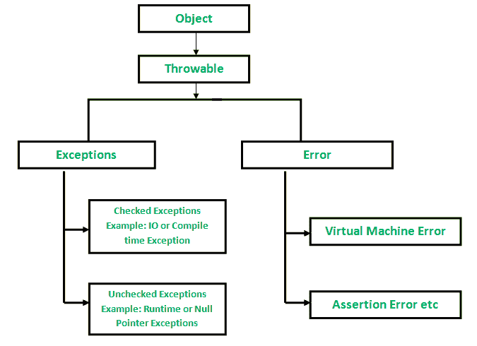

# Scala |异常处理

> 原文:[https://www.geeksforgeeks.org/scala-exception-handling/](https://www.geeksforgeeks.org/scala-exception-handling/)

**什么是例外？**

异常是在程序执行过程中，即在运行时发生的不想要的或意外的事件。这些事件改变了执行中程序的流程控制。这些情况不太危险，可以由程序处理。

**异常层次结构**

所有异常和错误类型都是类**的子类**，它是层次结构的基类。一家分公司由**领导，例外**。此类用于用户程序应该捕获的异常情况。NullPointerException 就是这种异常的一个例子。另一个分支，**错误**被 Java 运行时系统( [JVM](https://www.geeksforgeeks.org/jvm-works-jvm-architecture/) )用来指示与运行时环境本身(JRE)有关的错误。StackOverflowError 就是这样一个错误的例子。


**Scala 中的异常**

Scala 中的异常处理以不同的方式实现，但是它的行为与 Java 完全一样，并且与现有的 Java 库无缝协作。在 scala 中，所有异常都被**取消选中**。没有检查异常的概念，Scala 在选择是否捕获异常的能力方面提供了很大的灵活性。

**注意:**在编译时“已检查”的异常在 Java 中被检查。如果一个方法可能抛出一个*异常*，我们必须声明它。

【Scala 异常是如何工作的？

scala 中的异常与 C++或 Java 中的异常工作方式相同。当异常发生时，比如上例所示的一个算术异常，当前操作被中止，运行时系统寻找一个可以接受算术异常的异常处理程序。控件继续使用最里面的这样的处理程序。如果不存在这样的处理程序，程序将终止。

**把*抛出*异常**把
抛出异常。它看起来和 Java 中的一样。我们创建一个异常对象，然后使用 throw 关键字抛出它。
**语法:**

```scala
throw new ArithmeticException
```

***try/catch*构造**
try/catch 构造在 Scala 中与在 Java 中不同，Scala 中的 try/catch 是一个*表达式*。Scala 中的异常和导致值的异常可以在 catch 块中进行模式匹配，而不是为每个不同的异常提供单独的 catch 子句。因为 Scala 中的 try/catch 是一个表达式。这是一个在 Scala 中使用传统的 try-catch 块进行异常处理的例子。

```scala
// Scala program of try-catch Exception 
import java.io.IOException

// Creating object
object GFG
{  
    // Main method
    def main(args:Array[String])
    {  
        try
        {
            var N = 5/0

        } 
        catch 
        {
            // Catch block contain cases. 
            case i: IOException => 
            {
                println("IOException occurred.")
            }
            case a : ArithmeticException => 
            {
                println("Arithmetic Exception occurred.")
            }

        }

    }  
}  
```

**输出:**

```scala
Arithmetic Exception occurred.
```

在 Scala 中，单个 catch 块可以处理所有类型的异常，从而提供灵活性。

**最后条款:**

如果不管表达式如何终止，我们都希望执行代码的某个部分，那么我们可以使用 finally 块。下面是上面的一个例子:

```scala
// Scala program of finally Exception 

// Creating object
object GFG 
{
    // Main method
    def main(args: Array[String]) 
    {
        try
        {
            var N = 5/0
        } 
        catch
        {
            // Catch block contain case.
            case ex: ArithmeticException => 
            {
                println("Arithmetic Exception occurred.")
            }
        }
        finally
        {
            // Finally block will execute 
            println("This is final block.")
        }
    }
}
```

**输出:**

```scala
Arithmetic Exception occurred.
This is final block.
```