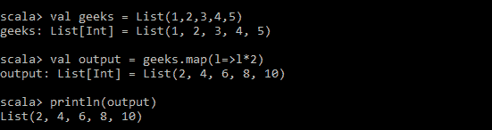
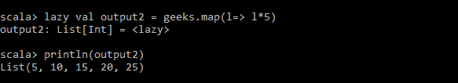

# Scala |惰性评估

> 原文:[https://www.geeksforgeeks.org/scala-lazy-evaluation/](https://www.geeksforgeeks.org/scala-lazy-evaluation/)

惰性评估或按需调用是一种评估策略，在这种策略中，表达式直到第一次使用时才被评估，也就是说，将评估推迟到需要的时候。像 **Haskell** 这样的函数式编程语言广泛使用这种策略。 **C、C++** 被称为*严格语言*，它们在表达式被声明后立即对其求值。还有像 Scala 这样的语言，默认情况下是严格的，但是如果明确指定，也就是混合类型的，就可能是懒惰的。

让我们看看 Scala 中的一个例子:

**不偷懒:**

```scala
val geeks = List(1, 2, 3, 4, 5)

val output = geeks.map(l=> l*2)

println(output)

```


一旦对输出值进行运算，输出值就会被计算出来。

**同懒:**

```scala
val geeks = List(1, 2, 3, 4, 5)

lazy val output2 = geeks.map(l=> l*2)

println(output2)

```



直到我们使用 output2，也就是直到 *println(output2)时，才计算该值。*

**为什么懒评价？**
在例子中如果我们从不使用产值呢？我们浪费了我们的地图操作(中央处理器计算)，当我们编写更复杂和更大的代码时，这可能会非常昂贵。这里的惰性评估帮助我们在*优化*过程，只在需要的时候评估表达式，避免不必要的开销。

**优点:**

*   优化计算过程。Spark 大数据计算引擎的核心就是使用这种技术。
*   惰性评估可以帮助我们解决循环依赖。
*   允许访问无限数据结构。
*   允许将代码模块化为多个部分。
*   程序员失去了对代码执行顺序的控制，因为一些表达式被求值，而另一些则不依赖于需要。

cons:t1]

*   发现 bug 可能很棘手，因为程序员无法控制程序的执行。
*   会增加空间复杂性，因为所有指令(操作)都必须存储。
*   与传统方法相比，更难编码。