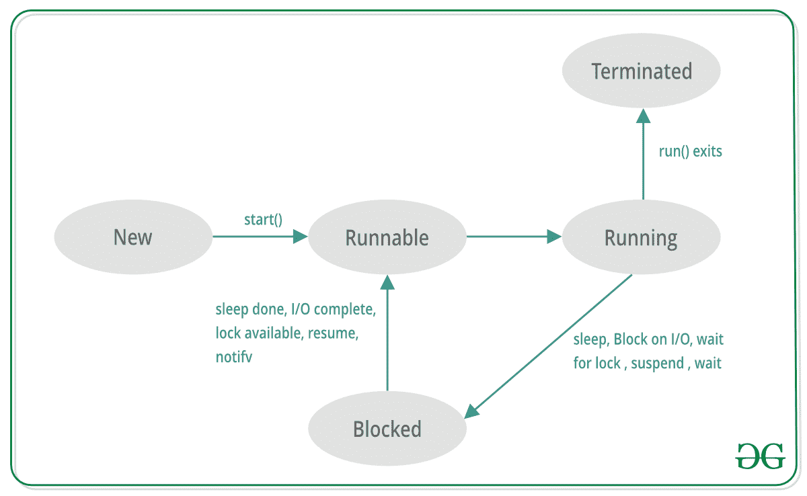

# Scala |多线程

> 原文:[https://www.geeksforgeeks.org/scala-multithreading/](https://www.geeksforgeeks.org/scala-multithreading/)

多个线程同时执行*的过程，称为**多线程**。它允许您独立执行多个任务。*

***Scala 中的线程是什么？***

**线程是轻量级的子进程，占用内存较少。*一个多线程程序包含两个或多个可以*并发运行的线程*，并且每个线程可以同时处理不同的任务，特别是当您的系统(计算机)有多个 CPU 时，可以最佳利用可用资源。多线程在 Scala 中用于开发并发应用程序。*

*Scala 中的线程可以通过两种机制来创建:*

1.  *扩展线程类*
2.  *扩展可运行接口*

*   ***Thread creation by extending the Thread class**

    我们创建了一个扩展**线程类**的类。此类重写线程类中可用的 run()方法。线程在 run()方法中开始它的生命。我们创建一个新类的对象，并调用 start()方法来启动线程的执行。Start()调用 Thread 对象上的 run()方法。

    ```
    // Scala code for thread creation by extending 
    // the Thread class 
    class MyThread extends Thread 
    {
        override def run()
        {
            // Displaying the thread that is running 
            println("Thread " + Thread.currentThread().getName() + 
                                            " is running.")
        }
    } 

    // Creating object
    object GFG
    {
        // Main method
        def main(args: Array[String])
        {
            for (x <- 1 to 5) 
            {
                var th = new MyThread()
                            th.setName(x.toString())
                                th.start()
            }
        }
    }
    ```

    **输出:**

    ```
    Thread 1 is running.
    Thread 2 is running.
    Thread 3 is running.
    Thread 4 is running.
    Thread 5 is running.

    ```* 
*   ***Thread creation by Extending Runnable Interface**

    我们创建了一个新的类，它扩展了 Runnable 接口并覆盖了 run()方法。然后我们实例化一个线程对象，将创建的类传递给构造函数。然后我们在这个对象上调用 start()方法。

    ```
    // Scala code for thread creation by implementing 
    // the Runnable Interface 
    class MyThread extends Runnable 
    {
        override def run()
        {
            // Displaying the thread that is running 
            println("Thread " + Thread.currentThread().getName() +
                                                " is running.")
        }
    } 

    // Creating object
    object MainObject
    {
        // Main method
        def main(args: Array[String])
        {
            for (x <- 1 to 5) 
            {
                var th = new Thread(new MyThread())
                            th.setName(x.toString())
                                th.start()
            }
        }
    }
    ```

    **输出:**

    ```
    Thread 1 is running.
    Thread 3 is running.
    Thread 4 is running.
    Thread 2 is running.
    Thread 5 is running.

    ```* 

***注意:**线程不需要以任何顺序运行。所有线程并发运行，相互独立。*

***Scala Thread Life Cycle***

*在创建和终止 Scala 线程期间，线程会经历各种状态变化。这些构成了 Scala 线程的生命周期。它有以下五种状态。*

*   ***新建:**这是线程刚创建时的第一个状态。*
*   ***Runnable :** 这是线程已经创建但线程没有机会开始运行的状态。*
*   ***运行:**在这种状态下，线程正在执行其任务。*
*   ***Blocked(或 Waiting):** 这是线程还活着，但由于等待输入或资源，当前无法运行的状态。*
*   ***已终止:**当线程的 run()方法退出时，线程处于死状态。*

**