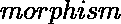

# Scala |多态性

> 原文:[https://www.geeksforgeeks.org/scala-polymorphism/](https://www.geeksforgeeks.org/scala-polymorphism/)

**多态性**是任何数据能够以多种形式进行处理的能力。这个词本身的意思是,表示许多，而表示类型。Scala 通过虚函数、重载函数和重载运算符实现多态性。多态性是面向对象编程语言最重要的概念之一。多态在面向对象编程中最常见的用途是当父类引用被用来引用子类对象时。这里我们将看到如何以多种类型和多种形式表示任何函数。现实生活中多态性的例子，一个人同时可以在生活中扮演不同的角色。喜欢一个女人的同时是母亲、妻子、员工和女儿。因此，同一个人必须有许多特征，但必须根据情况和条件实现每一个特征。多态性被认为是面向对象编程的重要特征之一。在 Scala 中，该函数可以应用于许多类型的参数，或者该类型可以有许多类型的实例。
多态性有两种主要形式:

*   **子类型:**在子类型中，子类的实例可以传递给基类
*   **泛型:**通过类型参数化，创建函数或类的实例。

以下是一些例子:
**例子#1:**

```scala
// Scala program to shows the usage of 
// many functions with the same name 
class example 
{ 

    // This is the first function with the name fun
    def func(a:Int) 
    { 
        println("First Execution:" + a); 
    } 

    // This is the second function with the name fun
    def func(a:Int, b:Int) 
    { 
        var sum = a + b; 
        println("Second Execution:" + sum); 
    } 

    // This is the first function with the name fun
    def func(a:Int, b:Int, c:Int) 
    { 
        var product = a * b * c; 
        println("Third Execution:" + product); 
    } 
} 

// Creating object
object Main      
{ 
    // Main method
    def main(args: Array[String]) 
    {
        // Creating object of example class
        var ob = new example(); 
        ob.func(120); 
        ob.func(50, 70);
        ob.func(10, 5, 6);
    } 
} 
```

**输出:**

```scala
First Execution:120
Second Execution:120
Third Execution:300

```

在上面的例子中，我们有三个名称相同(func)但参数不同的函数。

**例 2:**

```scala
// Scala program to illustrate polymorphism
// concept
class example2
{ 
    // Function 1 
    def func(vehicle:String, category:String)     
    { 
        println("The Vehicle is:" + vehicle); 
        println("The Vehicle category is:" + category); 
    } 

    // Function 2 
    def func(name:String, Marks:Int)      
    { 
        println("Student Name is:" + name); 
        println("Marks obtained are:" + Marks); 
    } 

    // Function 3 
    def func(a:Int, b:Int) 
    {
        var Sum = a + b;
        println("Sum is:" + Sum)
    }

} 

// Creating object
object Main 
{ 
    // Main method
    def main(args: Array[String]) 
    { 
        var A = new example2(); 
        A.func("swift", "hatchback"); 
        A.func("honda-city", "sedan"); 
        A.func("Ashok", 95);
        A.func(10, 20);
    } 
} 
```

**输出:**

```scala
The Vehicle is:swift
The Vehicle category is:hatchback
The Vehicle is:honda-city
The Vehicle category is:sedan
Student Name is:Ashok
Marks obtained are:95
Sum is:30

```