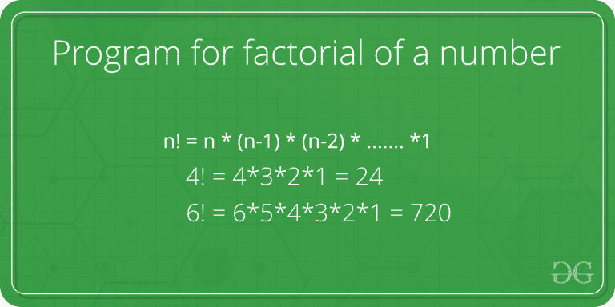

# Scala 程序求一个数的阶乘

> 原文:[https://www . geeksforgeeks . org/Scala-程序查找数字阶乘/](https://www.geeksforgeeks.org/scala-program-to-find-factorial-of-a-number/)

给定一个数字 **N** ，任务是计算 **N** 的阶乘。

在数学中，正整数 N 的阶乘是所有小于或等于 N 的正整数的乘积，计算给定正整数的阶乘 **N** 的递推公式为

```
N! = N * ( N -1 )! 
N! = 1 if N = 1 or N = 0

```



**示例:**

```
Input : N = 3 
Output : 6

Input : N = 5
Output : 120

```

**方法 1:迭代方式**
在这个方法中，我们将使用一个循环来迭代数字序列以获得阶乘。
以下是上述方法的实施
**例:**

```
// Scala Program to calculate
// Factorial of a number

// Creating object
object GFG
{
    // Iterative way to calculate
    // factorial 
    def factorial(n: Int): Int = {

        var f = 1
        for(i <- 1 to n)
        {
            f = f * i;
        }

        return f
    }

    // Driver Code
    def main(args: Array[String]) 
    {
        println(factorial(5))
    }

}
```

**Output :**

```
120

```

**方法二:使用递归**
在此方法中，递归公式 **N！= N * (N -1)！**用来计算给定数的阶乘。
以下是上述方法的实施。
**例:**

```
// Scala Program to calculate Factorial
// of a number using recursion

// Creating object
object GFG
{
    // Function to calculate
    // factorial using Recursive 
    // formula (i.e N! = N * N-1 !)
    def factorial(n: Int): Int =
    {
        if (n == 0) 
            return 1
        else
            return n * factorial(n-1)
    }

    // Driver Code
    def main(args: Array[String]) 
    {
        println(factorial(5))
    }
}
```

**Output :**

```
120

```