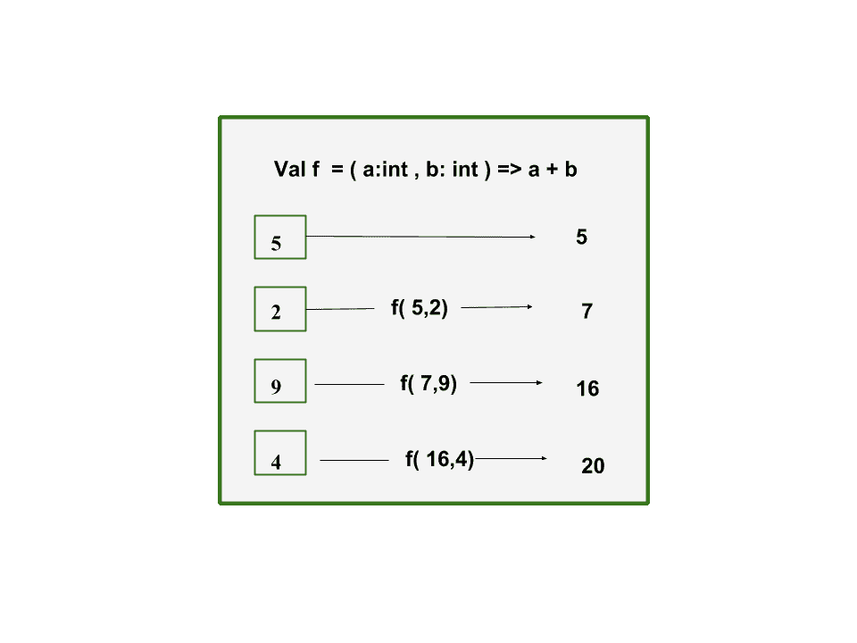
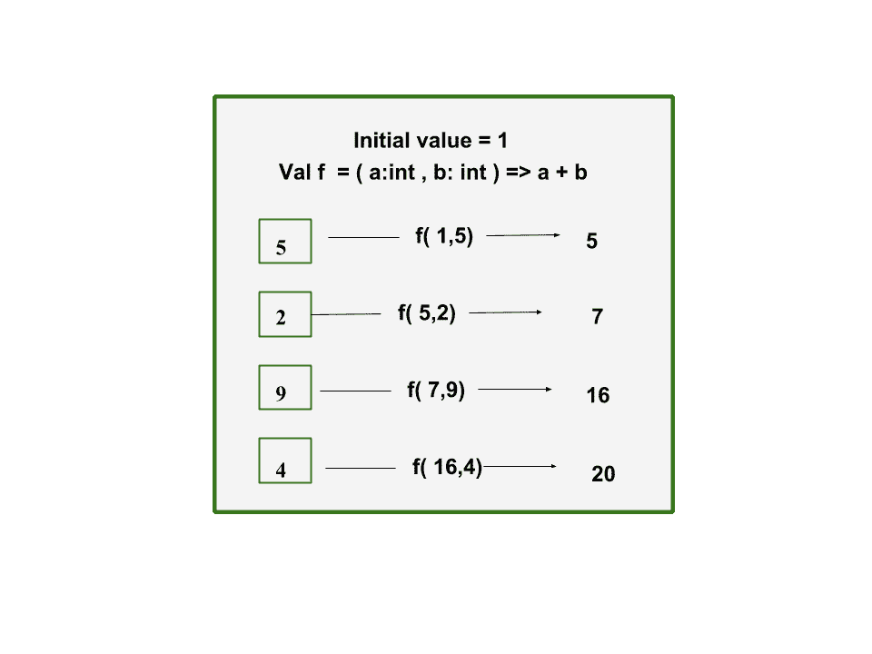
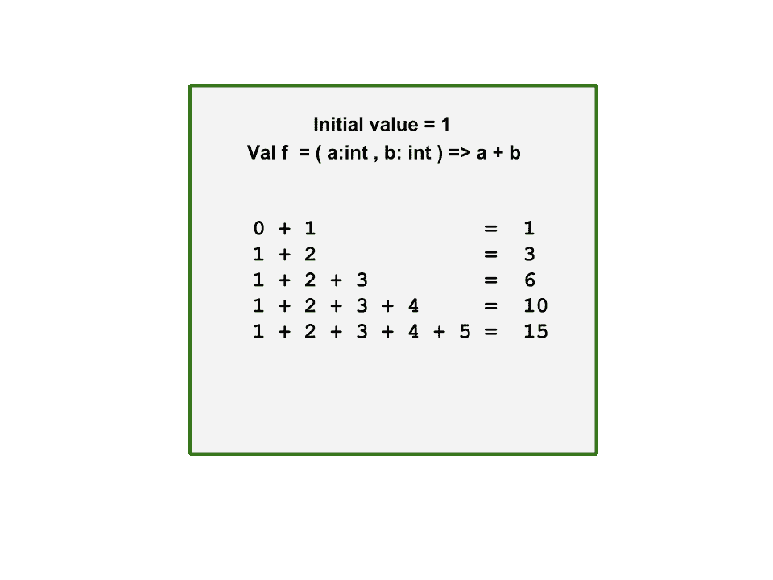

# Scala |缩小、折叠或扫描

> 原文:[https://www.geeksforgeeks.org/scala-reduce-fold-or-scan/](https://www.geeksforgeeks.org/scala-reduce-fold-or-scan/)

在本教程中，我们将学习 Scala 中的缩减、折叠和扫描功能。

1.  **Reduce :** Reduce function is applied on collection data structure in scala that contains lists, sets, maps, sequence and tuples. Parameter in the reduce function is a *binary operation* which merges all the elements from the collection and returns a single value. The first two values is combined with the binary operation and the resultant of that operation combines with the next value of the collection and atlast we obtain a single value.
    

    此代码使用 reduce 函数实现序列中元素的求和。
    **例:**

    ```scala
    // Scala program sum of elements 
    // using reduce function 

    // Creating object
    object geeks
    {
        // Main method
        def main(arg:Array[String])
        {
            // initialize a sequence of elements
            val seq_elements: Seq[Double] = Seq(3.5, 5.0, 1.5)
            println(s"Elements = $seq_elements") 

            // find the sum of the elements
            // using reduce function
            val sum: Double = seq_elements.reduce((a, b) => a + b)
            println(s"Sum of elements = $sum")
        }   
    }
    ```

    **输出:**

    ```scala
    Elements  = List(3.5, 5.0, 1.5)
    Sum of elements = 10.0

    ```

    该代码使用减少函数
    **找到序列中的最大和最小元素。示例:**

    ```scala
    // Scala program to find maximum and minimum 
    // using reduce function 

    // Creating object
    object geeks
    {
        // Main method
        def main(arg:Array[String])
        {
            // initialize a sequence of elements
            val seq_elements : Seq[Double] = Seq(3.5, 5.0, 1.5)
            println(s"Elements = $seq_elements")

            // find the maximum element using reduce function
            val maximum : Double = seq_elements.reduce(_ max _)
            println(s"Maximum element = $maximum")

            // find the minimum element using reduce function
            val minimum : Double = seq_elements.reduce(_ min _)
            println(s"Minimum element = $minimum")
        }
    }
    ```

    **输出:**

    ```scala
    Elements = List(3.5, 5.0, 1.5)
    Maximum element = 5.0
    Minimum element = 1.5

    ```

2.  **Fold :** Like reduce fold also takes a binary operation which merges all the elements from the collection and returns a single value. The difference is that fold allows us to define an initial value. Due to this property, fold can also manage empty collections. If the collection is empty, the value initialized becomes the final answer. Due to this we can also return a different value from the set of collection using initial value of some other datatype. Reduce can only return the value of the same type because its initial value is the first value from the collection.

    

    该代码使用 fold 函数实现序列中元素的求和。这里初始值取 0.0，因为序列是数据类型 Double。
    **例:**

    ```scala
    // Scala program sum of elements 
    // using fold function 

    // Creating object
    object geeks
    {
        // Main method
        def main(arg:Array[String])
        {
            // initialize a sequence of elements
            val seq_elements: Seq[Double] = Seq(3.5, 5.0, 1.5)
            println(s"Elements = $seq_elements") 

            // find the sum of the elements using fold function
            val sum: Double = seq_elements.fold(0.0)((a, b) => a + b)
            println(s"Sum of elements = $sum")
        }
    }
    ```

    **输出:**

    ```scala
    Elements = List(3.5, 5.0, 1.5)
    Sum of elements = 10.0

    ```

    这段代码用连字符连接字符串。我们使用初始值作为空字符串。因此，我们的 fold 方法将对空字符串应用运算符，并且使用 reduce，我们不会在集合的第一个值之前获得连字符。
    **例:**

    ```scala
    // Scala program concatenate string 
    // using fold function 

    // Creating object
    object geeks
    {
        // Main method
        def main(arg:Array[String])
        {
            // initialize a sequence of strings
            val str_elements: Seq[String] = Seq("hello",
                                "Geeks", "For", "Geeks")
            println(s"Elements = $str_elements") 

            // Concatenate strings with fold function
            val concat: String = str_elements.fold("")(
                                    (a, b) => a + "-" + b)
            println(s"After concatenation = $concat")
        }
    }    
    ```

    **输出:**

    ```scala
    Elements = List(hello, Geeks, For, Geeks)
    After concatenation = -hello-Geeks-For-Geeks

    ```

3.  **Scan :** Scan function takes the binary operation as parameter and returns the value for each element in collection for that operation. It returns each iteration for that binary operator in the collection. In scan also we can define the initial value.

    
    该代码使用扫描函数实现所有元素之和的迭代。
    T3】例:

    ```scala
    // Scala program sum of elements 
    // using scan function 

    // Creating object
    object geeks
    {
        // Main method
        def main(arg:Array[String])
        {
            //initialize a sequence of numbers
            val numbers: Seq[Int] = Seq(4, 2, 1, 6, 9)
            println(s"Elements of numbers = $numbers")

            //find the sum of the elements using scan function
            val iterations: Seq[Int] = numbers.scan(0)(_ + _)
            println("Running total of all elements" +
                    s"in the collection = $iterations")
        }
    }    
    ```

    **输出:**

    ```scala
    Elements of numbers = List(4, 2, 1, 6, 9)
    Running total of all elements in the collection = List(0, 4, 6, 7, 13, 22)

    ```

    这是用连字符连接字符串的实现，并显示了迭代。
    **例:**

    ```scala
    // Scala program concatenate string 
    // using scan function 

    // Creating object
    object geeks
    {
        // Main method
        def main(arg:Array[String])
        {
            // initialize a sequence of strings
            val str_elements : Seq[String] = Seq("hello", 
                                "Geeks", "For", "Geeks")
            println(s"Elements = $str_elements")

            // Concatenate strings with scan function
            val concat : Seq[String]
                        = str_elements.scan("")((a, b) => a + "-" + b)
            println(s"After concatenation = $concat")
        }
    }    
    ```

    **输出:**

    > 元素=列表(你好，极客，为，极客)
    > 串联后=列表(，-你好，-你好-极客，-你好-极客-为，-你好-极客-为极客)