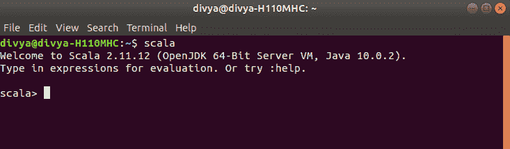
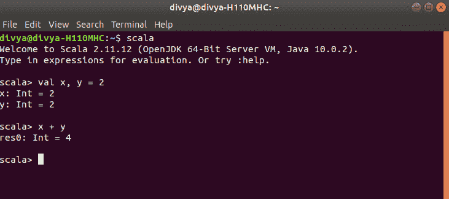
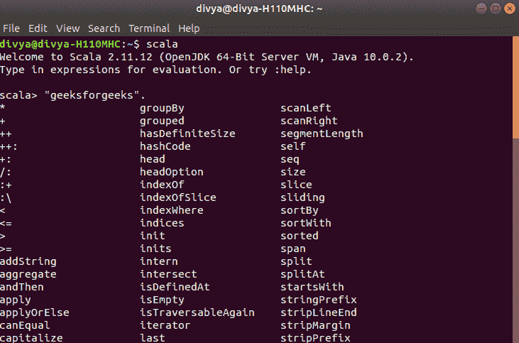

# 刻度|复盖

> 哎哎哎:# t0]https://www . geeksforgeeks . org/scale-repl/

Scala REPL 是一个交互式的**命令行解释器外壳**，其中 REPL 代表*读取-评估-打印-循环*。它的工作方式就像它只代表。它首先读取 Scala 命令行中作为输入提供的表达式，然后在屏幕上评估给定的表达式并打印表达式的结果，然后它再次准备好读取，这个过程循环进行。根据需要在当前表达式的范围内，自动导入以前的结果。REPL 在交互模式下根据提示读取表达式，然后将它们包装成可执行的模板，然后编译并执行结果。

<center>**实施 REPL**</center>

*   一个对象或一个类都可以用用户代码包装。使用的开关是**-基于类的。**
*   每一行输入都是单独编译的。
*   自动生成的导入包含对以前行的依赖关系。
*   **标量的隐含意义。预定义**可以通过输入显式导入来控制。

我们可以通过在控制台/终端中键入 **scala** 命令来启动 Scala REPL。

```
$scala
```


让我们了解一下如何使用 Scala REPL 添加两个变量。

在第一行中，我们初始化了 Scala REPL 中的两个变量。然后斯卡拉·REPL 印了这些。在这个例子中，我们可以看到它在内部创建了两个值为 Int 类型变量。然后我们用定义的两个变量来执行和的表达式。有了这个，斯卡拉·REPL 又在屏幕上打印了一份表情总结。这里它没有任何变量，所以它只显示了带有前缀 **res** 的临时变量。我们可以像创建变量一样使用这些变量。

我们可以通过调用 **getClass** 函数来获取这些临时变量的更多信息，如下所示。
T3】

我们可以在运行时用 scala REPL 做很多这样的实验，如果我们使用一些 IDE，这将会很耗时。使用 scala2.0，我们还可以通过按 TAB 键列出所有可以应用于变量的函数建议。


<center>**REPL 一些更重要的特色**</center>

*   REPL 的 IMain 必然会 **$intp** 。
*   使用**选项卡**键完成。
*   **最后一个异常**绑定 REPL 最后一个异常。
*   **:加载**用于加载一个 REPL 输入文件。
*   **:javap** 用于检查类工件。
*   **-Irepl-outdir**用于用外部工具检查类工件。
*   **:power** 进入编译器模式后导入编译器组件。
*   **:帮助**用于获取帮助用户的命令列表。