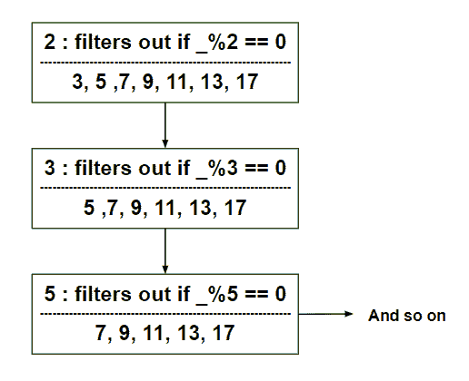

# 厄拉多塞斯卡拉筛

> 原文:[https://www.geeksforgeeks.org/scala-sieve-of-eratosthenes/](https://www.geeksforgeeks.org/scala-sieve-of-eratosthenes/)

昔兰尼的厄拉多塞是一位希腊数学家，他发现了一种惊人的寻找素数的算法。

本文在 Scala 中执行这个算法。

**步骤 1** :创建一个内部流

```scala
def numberStream(n: Int): 
    Stream[Int] = Stream.from(n)

println(numberStream(10))
```

以上步骤的输出为**流(10，？).**

**第二步:**厄拉多塞函数的筛选

```scala
// Defining Sieve of Eratosthenes
def sieve_of_Eratosthenes(stream: Stream[Int]): 
    Stream[Int] = stream.head #:: sieve_of_Eratosthenes(
        (stream.tail) 
        filter (x => x % stream.head != 0)
        )

println(sieve_of_Eratosthenes(numberStream(10)))
```

以上步骤的输出为**流(10，？)**。

**第三步:**提取“N”个素数

```scala
val no_of_primes = sieve_of_Eratosthenes(numberStream(2))

// Selecting number of primes
println(no_of_primes)
(no_of_primes take 7) foreach { 
    println(_) 
    }
```

以上步骤的输出为**流(2，？)
2
3
5
7
11
13
17**。

**下面是完整的程序**

```scala
def numberStream(n: Int): 
    Stream[Int] = Stream.from(n)

println(numberStream(10))

// Defining Sieve of Eratosthenes
def sieve_of_Eratosthenes(stream: Stream[Int]): 
    Stream[Int] = stream.head #:: sieve_of_Eratosthenes(
        (stream.tail) 
        filter (x => x % stream.head!= 0)
        )

println(sieve_of_Eratosthenes(numberStream(10)))

val no_of_primes = sieve_of_Eratosthenes(numberStream(2))

// Selecting number of primes 
println(no_of_primes)
(no_of_primes take 7) foreach { 
    println(_) 
    }
```

**输出:**

```scala
Stream(10, ?)
Stream(10, ?)
Stream(2, ?)
2
3
5
7
11
13
17

```

**来自代码的见解**

*   使用 **stream.form()，创建一个正在生成连续数字的流。这个数字从论证开始。**
*   一个数字流被赋予**“厄拉多塞的筛子”**方法。这个方法通过过滤掉元素，缓慢地生成连续的元素。

**下面是完整的工作代码，并有说明:**


**工作:** *abc()* 方法在 **filter()** 方法中插入调试语句。如果一个元素不能被头部整除，那么流就把它当作一个好的元素。代码打印它并返回 true。否则，打印过滤出的序列，最后返回流。
对厄拉多塞方法的**筛进行了一些修改，以便使用流创建–**ABC()**方法。元素从递归流中取出并打印出来。**

```scala
object Sieve extends App {
    def abc(s: Stream[Int], head: Int) = { 
        val r = s filter {
            x => {
                if (x % head != 0) {
                    println()
                    println(s"${x} is not evenly divisible by ${head}")

                    true
                    } 
                else {
                    println()
                    println(s"${x} is evenly divisible by ${head}. So Discard ${x}")
                false
                    }
                }
            }
        r
    }
    def numberStream(g: Int): Stream[Int] = Stream.from(g)

    def sieve_of_Eratosthenes(stream: Stream[Int]): 
    Stream[Int] = stream.head #:: sieve_of_Eratosthenes(
        abc(stream.tail, stream.head))

    val no_of_primes = sieve_of_Eratosthenes(numberStream(2))
    (no_of_primes take 7) foreach {
        println(_)
    }
}
```

**输出:**

```scala
2

3 is not evenly divisible by 2
3

4 is evenly divisible by 2\. So Discard 4

5 is not evenly divisible by 2

5 is not evenly divisible by 3
5

6 is evenly divisible by 2\. So Discard 6

7 is not evenly divisible by 2

7 is not evenly divisible by 3

7 is not evenly divisible by 5
7

8 is evenly divisible by 2\. So Discard 8

9 is not evenly divisible by 2

9 is evenly divisible by 3\. So Discard 9

10 is evenly divisible by 2\. So Discard 10

11 is not evenly divisible by 2

11 is not evenly divisible by 3

11 is not evenly divisible by 5

11 is not evenly divisible by 7
11

12 is evenly divisible by 2\. So Discard 12

13 is not evenly divisible by 2

13 is not evenly divisible by 3

13 is not evenly divisible by 5

13 is not evenly divisible by 7

13 is not evenly divisible by 11
13

14 is evenly divisible by 2\. So Discard 14

15 is not evenly divisible by 2

15 is evenly divisible by 3\. So Discard 15

16 is evenly divisible by 2\. So Discard 16

17 is not evenly divisible by 2

17 is not evenly divisible by 3

17 is not evenly divisible by 5

17 is not evenly divisible by 7

17 is not evenly divisible by 11

17 is not evenly divisible by 13
17

```