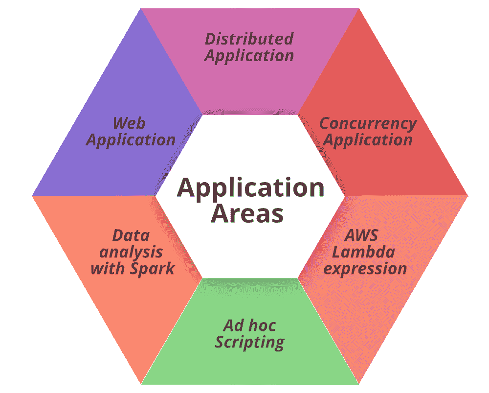
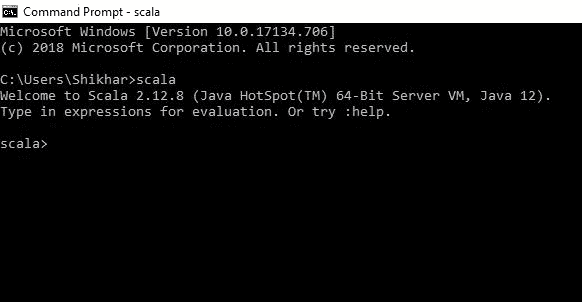
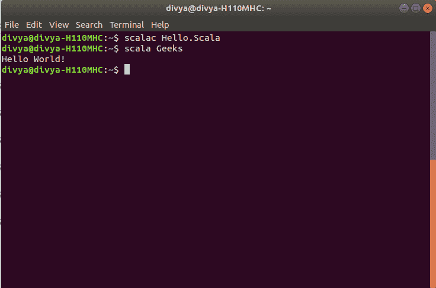

# Scala 教程–通过分步指南

学习 Scala

> 原文:[https://www . geeksforgeeks . org/Scala-教程-学习-Scala-带步骤指南/](https://www.geeksforgeeks.org/scala-tutorial-learn-scala-with-step-by-step-guide/)

[Scala](https://www.geeksforgeeks.org/scala-programming-language/) 是一种通用、高级、多范式的编程语言。它是一种纯面向对象的编程语言，也支持函数式编程方法。Scala 程序可以转换成字节码，并且可以在 JVM(Java 虚拟机)上运行。Scala 代表可伸缩语言。Scala 不提供任何支持。Net 框架。Scala 是由 EPFL 洛桑联邦理工学院编程方法教授、德国计算机科学家马丁·奥德斯基设计的。Scala 于 2004 年首次在 Java 平台上公开发布，作为它的第一个版本。2004 年 6 月。scala 的最新版本是 2.12.6，于 2018 年 4 月 27 日发布。


**主题:**

Features of Scala

[Scala](https://www.geeksforgeeks.org/scala-programming-language/) 受欢迎和受欢迎的原因有很多。下面提到的原因很少:

*   **面向对象:**[Scala](https://www.geeksforgeeks.org/scala-programming-language/)中的每个值都是一个对象，所以它是一种纯面向对象的编程语言。Scala 中的类和特性描述了对象的行为和类型。
*   **Functional:** 它也是一种函数式编程语言，因为每个函数都是一个值，每个值都是一个对象。它支持高阶函数、嵌套函数、匿名函数等。
*   **静态类型化:**验证和实施类型约束的过程是在编译时在 Scala 中完成的。不像其他静态类型的编程语言，如 C++，C 等。，Scala 不期望用户提供冗余类型的信息。在大多数情况下，用户不需要指定类型。
*   **可扩展:**新的语言构造可以以库的形式添加到 Scala 中。Scala 被设计成用 JRE(Java 运行时环境)进行插值。
*   **并发&同步处理:** Scala 允许用户以不可变的方式编写代码，这使得应用并行性(同步)和并发性变得容易。

### 应用领域



Getting Started with Scala

Scala 是一种非常兼容的语言，因此可以非常容易地安装到 Windows 和 Unix 操作系统中。
由于 Scala 在语法上与其他广泛使用的语言非常相似，所以在 Scala 中编码和学习更容易。scala 程序可以写在任何纯文本编辑器上，比如记事本、notepad++,或者任何类似的东西。人们也可以使用一个[在线 ide 来编写 Scala 代码](https://ide.geeksforgeeks.org/VQWhtqE5V9)或者甚至可以在他们的系统上安装一个，使编写这些代码更加可行，因为 IDE 提供了许多功能，比如直观的代码编辑器、调试器、编译器等。
首先，编写 scala 代码并执行各种有趣而有用的操作，必须在他们的系统上安装 Scala。这可以通过遵循下面提供的逐步说明来完成:

1.  **验证 Java 包**
    我们首先需要在电脑上安装一个 Java 软件开发工具包(SDK)。我们需要验证这个软件开发工具包包，如果没有安装，然后安装它们。
2.  **现在安装 Scala**
    我们已经完成了 java 的安装，现在让我们安装 Scala 包。下载这些包的最佳选择是仅从官方网站下载:[https://www.scala-lang.org/download/](https://www.scala-lang.org/download/)上面链接中的包大约是 100MB 的存储空间。下载软件包后，打开下载的。msi 文件。
3.  **测试并运行 Scala 命令**
    现在打开命令提示符，输入以下代码。

```
C:\Users\Your_PC_username>scala
```

1.  我们将收到如下所示的输出:



1.  命令的输出。

How to Run a Scala Program ?

让我们考虑一个简单的 Hello World 程序。

## 斯卡拉

```
// Scala program to print Hello World

// Creating object 
object Geeks { 

// Main method 
def main(args: Array[String]) 
{ 

    // prints Hello, Geeks! 
    println("Hello, World!") 
} 
}  
```

**输出:**

```
Hello, World!
```

一般来说，运行 Scala 程序有两种方式-

*   **使用** [**在线 ide**](https://ide.geeksforgeeks.org/VQWhtqE5V9)**:**我们可以使用各种在线 ide，不用安装就可以运行 Scala 程序。
*   **使用命令行:**我们也可以使用命令行选项来运行 Scala 程序。以下步骤演示了如何在 Windows/Unix 操作系统中命令行运行 Scala 程序:

    打开命令行，然后编译代码类型 **scala Hello.scala** 。如果您的代码没有错误，那么它将正确执行并显示输出。



Fundamentals of ScalaVariables

[变量](https://www.geeksforgeeks.org/variables-in-scala/)只是一个存储位置。每个变量都以其名称为人所知，并存储一些已知和未知的信息，称为值。在 Scala 中有两种类型的变量:

*   **可变变量:**这些变量是那些在变量声明后允许我们改变值的变量。可变变量是通过使用“var”关键字定义的。
*   **不可变变量:**这些变量是在变量声明后不允许更改值的变量。不可变变量是通过使用“val”关键字定义的。

**例:**

```
// Mutable Variable
var name: String = "geekforgeeks";

// Immutable Variable
val name: String = "geekforgeeks";
```

要了解更多关于 ***Scala 变量*** 的信息，请参考–[Scala 中的变量](https://www.geeksforgeeks.org/variables-in-scala/)、[Scala 中的变量范围](https://www.geeksforgeeks.org/scope-of-variables-in-scala/)。

Operators

运算符是一种符号，表示要用一个或多个操作数执行的操作。运算符允许我们对操作数执行不同类型的操作。Scala 中使用的运算符有以下不同类型:

*   [算术运算符](https://www.geeksforgeeks.org/operators-in-scala/#Arithmetic Operators)

*   [关系运算符](https://www.geeksforgeeks.org/operators-in-scala/#Relational Operators)
*   [逻辑运算符](https://www.geeksforgeeks.org/operators-in-scala/#Logical Operators)
*   [分配操作员](https://www.geeksforgeeks.org/operators-in-scala/#Assignment Operators)
*   [按位运算符](https://www.geeksforgeeks.org/operators-in-scala/#Bitwise Operators)

**例:**

## 斯卡拉

```
// Scala program to demonstrate 
// the Operators

// Creating object
object Geeks 
{ 

    // Main method
    def main(args: Array[String]) 
    { 

        // Operands 
        var a = 10; 
        var b = 4; 
        var c = true;
        var d = false;
        var result = 0;

        // using arithmetic operators  
        println ("Addition is: "+ (a + b) ); 
        println ("Subtraction is: "+ (a - b) ) ; 

        // using Relational Operators 
        if (a == b) 
        { 
           println ("Equal To Operator is True"); 
        }  
        else
        { 
           println ("Equal To Operator is False"); 
        } 

        // using Logical Operator 'OR'
        println("Logical Or of a || b = " + (c || d));  

        // using Bitwise AND Operator 
        result = a & b; 
        println ("Bitwise AND: " + result ); 

        // using Assignment Operators 
        println ("Addition Assignment Operator: " + (a += b) ); 

    } 
} 
```

**Output:** 

```
Addition is: 14
Subtraction is: 6
Equal To Operator is False
Logical Or of a || b = true
Bitwise AND: 0
Addition Assignment Operator: ()
```

Decision Making

编程中的决策类似于现实生活中的决策。Scala 使用控制语句根据某些条件来控制程序的执行流程。这些用于使执行流程前进，并根据程序状态的变化进行转移。

#### Scala 中的决策语句:

*   如果
*   如果不是这样
*   嵌套–如果
*   if–elsif 梯子

**例 1:** 举例说明 if 和 if-else 的用法

## 斯卡拉

```
// Scala program to illustrate the if and if-else statement 
object Test 
{ 

// Main Method 
def main(args: Array[String])
{ 

    // taking a variable 
    var a: Int = 650

    // if condition to check 
    // for even number 
    if(a % 2 == 0) 
    { 
        println("Even Number") 
    } 

    if (a > 698) 
    { 

        // This statement will not 
        // execute as a > 698 is false 
        println("GeeksforGeeks") 
    } 

    else
    { 

        // This statement will execute 
        println("Sudo Placement") 
    } 
} 
} 
```

**Output:** 

```
Even Number
Sudo Placement
```

**例 2:** 说明嵌套 if 的使用

## 斯卡拉

```
// Scala program to illustrate  
// Nested if statement 
object Test 
{ 

// Main Method 
def main(args: Array[String])
{    
    var a: Int = 10; 

    if(a % 2 == 0) 
    {  
        // Nested - if statement 
        // Will only be executed  
        // if above if statement 
        // is true 
        if(a % 5 == 0) 
        {   
            println("Number is divisible by 2 and 5\n")   
        }  
    } 
}
}
```

**Output:** 

```
Number is divisible by 2 and 5
```

欲了解更多关于决策制定的信息，请参考
斯卡拉 [**决策制定**](https://www.geeksforgeeks.org/scala-decision-making-if-if-else-nested-if-else-if-else-if/)

Loops

编程语言中的循环是一种功能，当某些条件评估为真时，它有助于重复执行一组指令/函数。循环使程序员的任务更简单。Scala 提供了不同类型的循环来处理程序中基于条件的情况。Scala 中的循环是:

*   [**为回路**](https://www.geeksforgeeks.org/for-loop-in-scala/)

## 斯卡拉

```
// Scala program to illustrate for loop 
object forloopDemo { 

   // Main Method 
   def main(args: Array[String]) { 

      var y = 0; 

      // for loop execution with range 
      for(y <- 1 to 4) 
      { 
         println("Value of y is: " + y); 
      } 
   } 
} 
```

**Output:** 

```
Value of y is: 1
Value of y is: 2
Value of y is: 3
Value of y is: 4
```