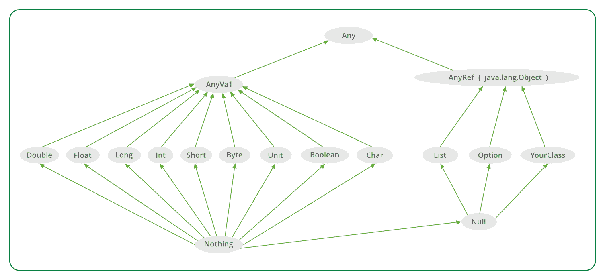

# 标量类型层次结构

> 原文:[https://www.geeksforgeeks.org/scala-type-hierarchy/](https://www.geeksforgeeks.org/scala-type-hierarchy/)

Scala 中没有基本类型(不像 java)。Scala 中的所有数据类型都是对象，它们有方法来操作它们的数据。Scala 的所有类型都作为**类型层次结构**的一部分存在。

我们在 Scala 中定义的每个类也将自动属于这个层次结构。


***任意*** 是所有类的超类，也叫顶级类。它定义了一些通用的方法，如 equals、hashCode 和 toString。任何都有两个直接的子类:

*   安雅瓦尔
*   任何参考

。
**例:**

```scala
// Scala program of Scala Type hierarchy 

// Creating object
object Geeks 
{

    // Main method
    def main(args: Array[String]) 
    {
        val list: List[Any] = List(
                false,
                66677,
                732, 
                'a', 
                "abs"
                    )

        list.foreach(element => println(element))
    }
}
```

**Output:**

```scala
false
66677
732
a
abs

```