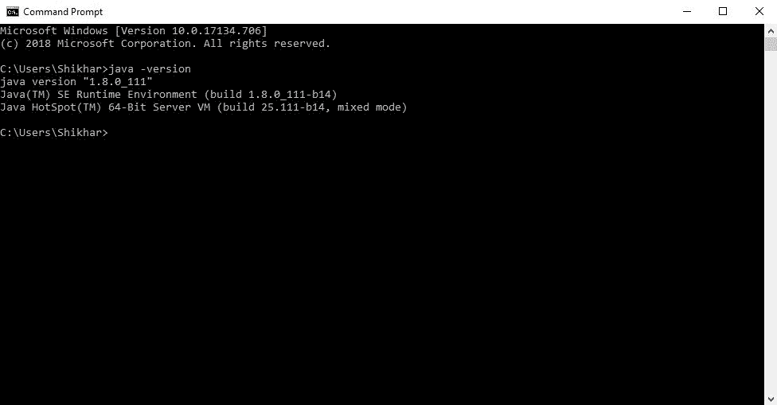

# 在 Scala 中设置环境

> 原文:[https://www . geeksforgeeks . org/setting-the-environment-in-Scala/](https://www.geeksforgeeks.org/setting-up-the-environment-in-scala/)

Scala 是一种非常兼容的语言，因此可以非常容易地安装到 Windows 和 Unix 操作系统中。在本教程中，我们将学习如何在 Scala 中继续安装和设置环境。最基本的要求是，我们必须在您的计算机上安装 Java 1.8 或更高版本。我们将分别研究 Windows 和 Unix 的步骤。

**第一步:验证 Java 包**
我们首先需要在电脑上安装一个 Java 软件开发工具包(SDK)。我们需要验证这个软件开发工具包包，如果没有安装，然后安装它们。打开命令窗口，输入以下命令:

**适用于车窗**

```scala
C:\Users\Your_PC_username>java -version
```

执行该命令后，输出将显示 java 版本，输出如下:

```scala
java version "1.8.0_111"
Java(TM) SE Runtime Environment (build 1.8.0_111-b14)
Java HotSpot(TM) 64-Bit Server VM (build 25.111-b14, mixed mode)
```

如果已经安装了 java，我们将得到这个输出

**对于 Linux**

```scala
$ java -version
```

执行该命令后，输出将显示 java 版本，输出如下:

```scala
java version "1.8.0_20"
Java(TM) SE Runtime Environment (build 1.8.0_20-b26)
Java HotSpot(TM) 64-Bit Server VM (build 25.20-b23, mixed mode)
```

如果我们得到了上面的输出，那么我们已经安装了最新的 java SDK，我们准备好进入第 2 步。如果我们没有安装 SDK，那么根据计算机要求从[https://www . Oracle . com/tech network/Java/javase/downloads/JDK 12-downloads-5295953 . html](https://www.oracle.com/technetwork/java/javase/downloads/jdk12-downloads-5295953.html)下载最新版本，然后继续安装。

**步骤 2:现在安装 Scala**
我们已经完成了 java 的安装，现在让我们安装 Scala 包。下载这些包的最佳选择是仅从官方网站下载:[https://www.scala-lang.org/download/](https://www.scala-lang.org/download/)上面链接中的包大约是 100MB 的存储空间。下载软件包后，打开下载的。msi 文件，并遵循下面给出的截图:

1.  **点击下一步按钮**
    
    点击下一步按钮如图所示。
2.  **现在这个画面会出现**
    
    勾选“我同意选项”，然后点击下一步
3.  **继续安装**
    
    点击安装按钮。
4.  **安装过程开始**
    
    允许软件包安装
5.  **The Installation is Over**
    
    Click on the FINISH button

    现在包已经准备好了，我们都准备好使用 Scala 了。

**步骤 3:测试并运行 Scala 命令**
现在打开命令提示符，输入以下代码

```scala
C:\Users\Your_PC_username>scala

```

我们将收到如下所示的输出:

命令的输出。

既然我们已经在系统中安装了 Scale，我们现在可以编写一些命令来测试一些 Scala 语句:

```scala
scala>println("Hi, Learning Scala")
scala>4+5
scala>6-2
```


上述命令的输出。

Scala 环境现在已经可以使用了。我们现在可以通过在命令提示符窗口中键入命令来处理 Scala。