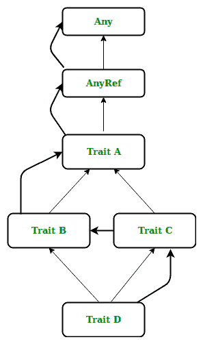

# Scala 中的性状线性化

> 原文:[https://www.geeksforgeeks.org/trait-linearization-in-scala/](https://www.geeksforgeeks.org/trait-linearization-in-scala/)

**Scala 线性化**是一个确定性的过程，当一个类的对象被创建时，这个过程开始发挥作用，这个类的对象是使用不同特征和类的继承来定义的。线性化有助于解决当一个类或特征从两个不同的具体类或特征继承相同属性时出现的钻石问题。

**语法:**

```
trait C{}
trait B{}
class A{}
object a_obj= new class A extends B with C

```

线性化如下所示

```
C-> AnyRef-> Any   
B-> AnyRef-> Any   
A-> AnyRef-> Any    
a_obj-> A-> C-> B-> AnyRef-> Any     

```

这里 **Any** 是所有类的超类，也叫顶级类。它定义了一些通用的方法，如 equals、hashCode 和 toString。**任意参考**代表参考类。所有非值类型都被定义为引用类型。AnyRef 对应于 java.lang.object。每个 Scala 特性和类都在线性化层次结构的末尾隐式扩展了这些 Scala 对象。

**示例:**

```
// Scala program defining trait A
trait A
{
    def name: String
}

// defining trait B inheriting A
trait B extends A
{
    override def name: String ="class b"
}

// defining trait C inheriting A
trait C extends A
{
    override def name: String ="class c"
}

// defining class D inheriting B and C both
class D extends B with C
{
    override def name: String = super.name
}

// Creating object
object GFG
{
    // Main method
    def main(args: Array[String])
    {
        var class_d = new D

        // whose property will be inherited
        println(class_d.name)
    }
}
```

**输出:**

```
class c

```

**D 级线性化**遵循黑色粗箭头。**继承**为 D 级跟随光箭。

[](https://media.geeksforgeeks.org/wp-content/uploads/20190529151042/Trait-Linearization-.jpg)

性状线性化和遗传图

从上图中我们可以看出，线性化将不同于继承结构。Scala 特性/类被动态地以线性顺序放置，线性化将被应用如下。

```
D-> C-> B-> A-> AnyRef-> Any

```

**确定线性化遵循以下规则:**

1.  取第一个**扩展的**性状/类，以垂直形式写出其完整的继承层次，将这个层次存储为 x。
2.  带子句的**后取下一个性状/类，写出其完整的层次结构，取消层次结构 x 中重复出现的类或性状，将剩余性状/类添加到层次结构 x 的前面。**
3.  转到第 2 步，重复这个过程，直到没有遗漏任何特征/类别。
4.  将类本身放在层次结构的前面，作为编写层次结构的头。

让我们理解一些例子。
**例:**

```
// Scala program for linearization
// defining old_car class
class old_Car
{
    def method: String= "old car "
}

// defining new_Car_Designs trait
trait new_Car_Designs extends old_Car
{
    override def method: String ="Designing-> "+ super.method
}

// defining new_Car_Part trait
trait new_Car_Part extends old_Car
{
    override def method: String = "Add new part-> "+ super.method
}

// defining new_Car_Paint trait
trait new_Car_Paint extends old_Car
{
    override def method: String = "Repainting-> "+ super.method
}

// defining new_Car class
class new_Car extends new_Car_Paint with 
new_Car_Part with new_Car_Designs
{
    override def method: String = "new car-> "+ super.method
}

// Creating object
object geekforgeeks
{
    // Main method
    def main(args: Array[String])
    {
        // new_Car object
        var car1 = new new_Car
        println(car1.method)
    }
}
```

**输出:**

```
new car-> Designing-> Add new part-> Repainting-> old car 

```

**示例:**

```
// Scala program for trait linearization
// defining classes and traits
class flavour 
{
    def make (flavour: String): Unit = 
    {
        println(flavour)
    }
}

// defining texture trait
trait texture extends flavour
{
    abstract override def make (flavour : String) 
    {
        super.make(flavour + "texture ")
    }
}

// defining cream trait
trait cream extends texture 
{
    abstract override def make (flavour : String)
    {
        super.make(flavour + "with cream ")
    }
}

// defining jelly trait
trait jelly extends texture 
{
    abstract override def make (flavour : String)
    {
        super.make(flavour + "with jelly ")
    }
}
// defining cone trait
trait cone extends flavour 
{
    abstract override def make (flavour : String)
    {
        super.make(flavour + "in cone ")
    }
}

// creating new ice-cream flovours 
// with above traits and classes
// inheriting different traits and classes
class Myflavour extends flavour with jelly 
{
    override def make (flavour : String) 
    {
        super.make(flavour)
    }
}
class Myflavour2 extends flavour with cream with cone
{
    override def make (flavour : String)
    {
        super.make(flavour)
    } 
}

// Creating object
object GFG
{
    // Main method
    def main(args: Array[String])
    {
        // creating new objects
        var icecream1 = new Myflavour
        var icecream2 = new Myflavour2 with jelly
        println(icecream1.make("chocolate "))
        println(icecream2.make("vanilla ")) 
    }
}
```

**输出:**

```
chocolate with jelly texture 
()
vanilla with jelly in cone with cream texture 
()

```

#### 关于线性化的要点

*   Scala 通过线性化过程解决特征/类的模糊性。
*   每当一个新类被实例化时，Scala 就使用线性化。获取所有的特征/类，并形成一个指向对应的超类/特征的线性顺序，这样**超**方法就知道它的父方法。
*   这些超级方法调用是以可堆叠的方式完成的。
*   线性化可能与编写时继承的 mixins 相同，也可能不同。
*   当一个类已经在线性化中被隐式继承时，我们不能显式地将它添加到继承中，否则它将作为**继承两次**而导致错误。
*   线性化中没有重复的特性/类别。