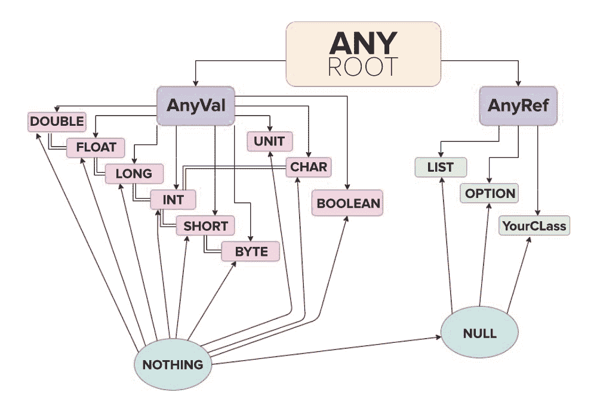

# Scala 中的统一类型系统

> 原文:[https://www.geeksforgeeks.org/unified-type-system-in-scala/](https://www.geeksforgeeks.org/unified-type-system-in-scala/)

在本文中，我们将讨论**统一类型系统**如何在 Scala 中工作。一个统一的类型系统本质上意味着有一个**超类型**，其他**子类型**继承。在 Scala 中，超级类型是类 ****【任意**** 。因此任何类都被称为 ***根*** 。从任意，派生出两个子类。

1.  ***AnyVal:*** 所有值类型都扩展到 AnyVal 类。有九种预定义的值类型，它们不可为空:Double、Float、Long、Int、Short、Byte、Char、Unit 和 Boolean。
2.  ***AnyRef:*** 所有引用类型都扩展到 AnyRef 类。默认情况下，用户定义的类定义引用类型；即它们总是(间接)子类 scala.AnyRef. scala。java 编程中的 AnyRef 对应于 java.lang.Object。

由于 Scala 运行在 Java 虚拟机上，它需要明确区分值类型和引用类型。为此，两个子类 AnyVal 和 AnyRef 可以从根继承，即 Any。不像大多数其他语言，如 Java、C 等。Scala 没有内置的基本类型。这些字节大小的数据类型被称为值类型，是 AnyVal 类的子类，后者又扩展到 Any(根)。这类似于 Java 等语言中的包装类或装箱类。换句话说，由于统一类型系统，所有字节大小的数据类型都是子类，继承自根类。但是，Scala 中属于值类型的变量不能用新关键字实例化。新关键字可用于引用类型。

下图表示值和引用类型如何与父类和根相关。


在上图中，

*   **箭头**代表传承。
*   **双线**代表层次和隐式类型转换。

使用统一类型系统的优势如下:

*   与其他类型的系统相比，更多的*型安全*。
*   *用其他语言创建的对象的互操作性和集成*更容易。
*   所有变量都可以使用某些通用的方法，如等号、哈希码和字符串。这是因为所有的变量都是继承自根类 Any 的类的实例，通用方法就是在这里定义的。

让我们用一个例子来看看拥有统一类型系统的功能。

```
// Scala Program to print common elements
// from 2 lists
object Geek
{
    def main(args:Array[String])
    {
        // Creating a list with a fixed data type
        val GfG : List[String] = List("Geeks","for","Geeks")

        // Creating a List which can take 
        // variable data type input by Using Any
        val myList : List[Any] = List(
            "Geeks",
            "for",
            "Geeks",
            1000,
            525)
    myList.foreach( value => {

        //.contains() is an universally declared function
        if (GfG.contains(value)){
            println(value)
        }
    })
    }
}
```

**输出:**

```
Geeks
for
Geeks

```

在上面的例子中，我们看到我们能够通过指定类型 ***【任意** *来创建包含不同数据类型的值的列表。因为 Any 是根类，所以这个表达式是合法的。此外，我们使用了一种方法**。contains()** 查看 List GfG 是否包含特定元素。**。contains()** 方法可用于列表、集合和某些其他集合，因为它是**通用函数**，存在于*任何*类中。这只有在统一类型系统的帮助下才有可能，统一类型系统使得 scala 作为一种处理大数据分析的语言更加健壮和实用。**