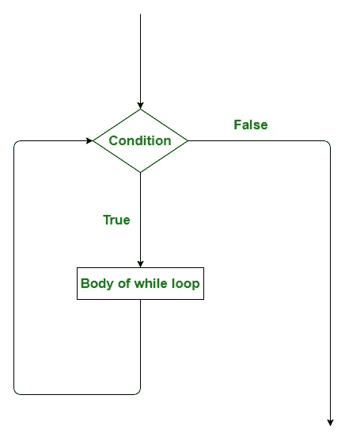
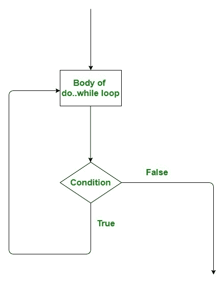

# 在 Scala 中一边循环一边做

> 原文:[https://www . geesforgeks . org/while-and-do-while-loop-in-Scala/](https://www.geeksforgeeks.org/while-and-do-while-loop-in-scala/)

编程语言中的循环是一种功能，当某些条件评估为真时，它有助于重复执行一组指令/函数。循环使程序员的任务更简单。Scala 提供了不同类型的循环，但是在本文中我们理解 while 和 do-while 循环。

**while loop**

在编程时，可能会有这样的情况，我们需要重复，直到满足某个条件。在这些情况下，使用 while 循环。while 循环通常在括号中带一个条件。如果条件为真，则执行 while 循环体中的代码。当我们不知道希望循环执行的次数，但是我们知道循环的终止条件时，就使用 while 循环。循环停止的条件称为中断条件。
**语法:**

```scala
while (condition)
{
    // Code to be executed
}
```

**流程图:**



**示例:**执行 While 循环

## 斯卡拉

```scala
// Scala program of while loop

// Creating object
object GFG
{
    // Main method
    def main(args: Array[String])
    {
        // variable declaration (assigning 5 to a)
        var a = 5

        // loop execution
        while (a > 0)
        {
            println("a is : " + a)
            a = a - 1;
        }
    }
}
```

**输出:**

```scala
a is : 5
a is : 4
a is : 3
a is : 2
a is : 1
```

**示例:**在数组中查找元素

## 斯卡拉

```scala
// Scala program of while loop

// Creating object
object GFG
{
   // Main method
   def main(args: Array[String])
   {
       // variable declaration (assigning 5 to a)
       var a = Array("do_while", "for", "while")
       var index = 0

       // loop execution
       while (index < a.length)
       {
           if(a(index) == "while")
               println("index of while is " + index)
           index = index + 1
       }
   }
}
```

**输出:**

```scala
index of while is 2
```

**注意:**要执行以下命令，请使用 Intellij。以 file_name.scala 格式保存此程序，并在 Intellij 中使用 scala 运行它。

**do while loop**

做..while 循环与 while 循环几乎相同。唯一不同的是..而循环至少运行一次。第一次执行后检查条件。做..当我们希望循环至少运行一次时，使用 while 循环。它也称为退出控制循环，因为在执行循环后会检查条件。在 while 循环中，条件放在循环的顶部，而在 do 循环中，条件放在末尾，由于条件的这种定位，do while gets 下的所有语句至少执行一次。
**语法:**

```scala
do {

// statements to be Executed

} while(condition);
```

**流程图:**



**示例:**执行 do while 循环

## 斯卡拉

```scala
// Scala program of do-while loop

// Creating object
object GFG
{
    // Main method
    def main(args: Array[String])
    {
        // variable declaration (assigning 5 to a)
        var a = 5;

        // loop execution
        do
        {
            println("a is : " + a);
            a = a - 1;
        }
        while (a > 0);
    }
}
```

**输出:**

```scala
a is : 5
a is : 4
a is : 3
a is : 2
a is : 1
```

**示例:**运行循环，直到遇到数组中的字符串

## 斯卡拉

```scala
// Scala program for do-while loop

// Creating object
object GFG
{
    // Main method
    def main(args: Array[String])
    {
        // Declaring an array
        var a = Array("hello", "This", "is", "geeksforgeeks", "bye")
        var str = "bye"
        var i = 0

        // loop execution
        do
        {
            println("program is saying " + a(i));
            i = i + 1;
        }
        while (a(i) != str);
    }
}
```

**输出:**

```scala
program is saying hello
program is saying This
program is saying is
program is saying geeksforgeeks
```

在上面的代码中，不会打印*再见*。